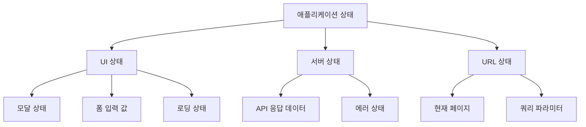
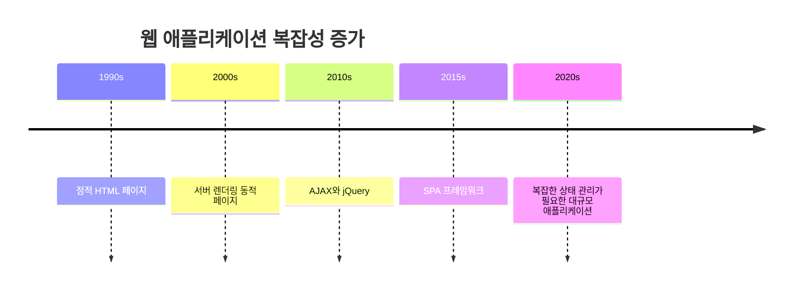
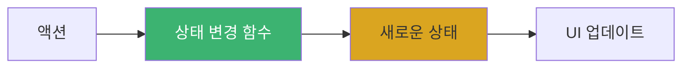
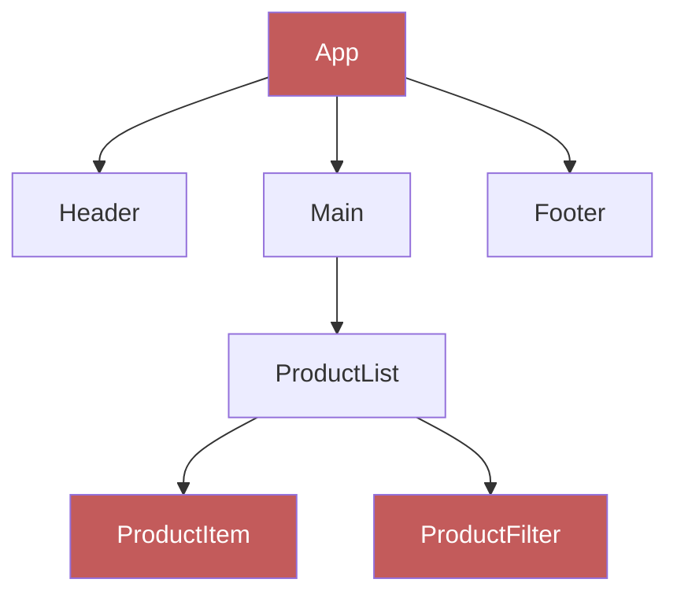
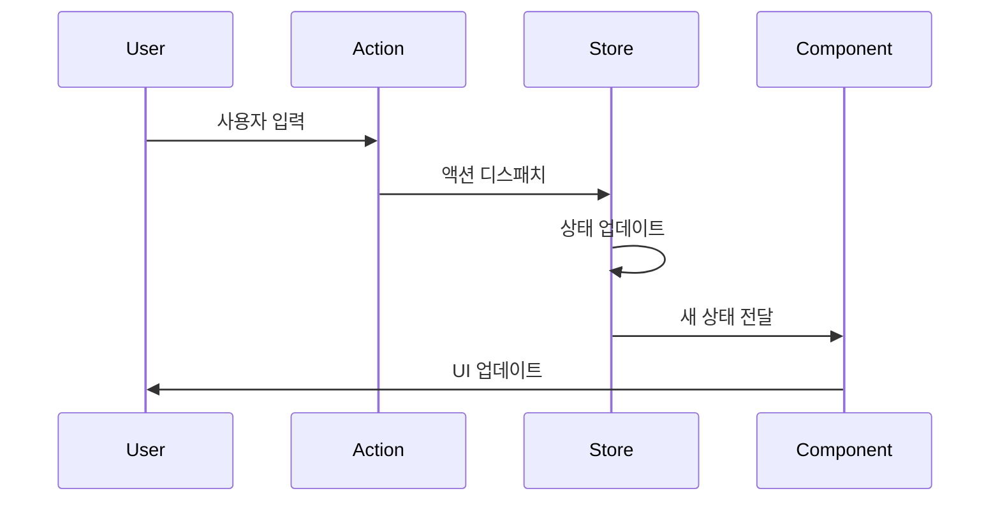

# Chapter 01 상태 관리 소개

## 01-1 상태 관리란 무엇인가

### 개요
프론트엔드 애플리케이션이 복잡해지면서 상태 관리는 개발자가 직면하는 가장 중요한 과제 중 하나가 되었습니다. 이 섹션에서는 상태 관리의 기본 개념, 필요성, 그리고 효과적인 상태 관리가 애플리케이션 개발에 미치는 영향에 대해 알아봅니다.

### 상태(State)의 정의

상태(State)란 특정 시점에서 애플리케이션의 데이터를 나타내는 객체입니다. 이는 사용자 입력, 서버 응답, 시간 경과에 따라 변화하는 모든 데이터를 포함합니다.

#### 상태의 종류

프론트엔드 애플리케이션에서 상태는 다양한 형태로 존재합니다:

1. **UI 상태**: 모달 창의 열림/닫힘, 로딩 인디케이터, 폼 입력 값 등 사용자 인터페이스와 관련된 상태
2. **애플리케이션 상태**: 사용자 인증 정보, 테마 설정 등 애플리케이션 전반에 영향을 미치는 상태
3. **서버 상태**: API에서 가져온 데이터, 캐시된 응답 등 서버와의 통신 결과를 나타내는 상태
4. **URL 상태**: 현재 페이지, 쿼리 파라미터 등 URL에 반영되는 상태



### 상태 관리의 필요성

#### 복잡성 증가

현대 웹 애플리케이션은 점점 더 복잡해지고 있습니다. 단순한 정적 페이지에서 시작하여 이제는 데스크톱 애플리케이션과 유사한 기능을 제공하는 복잡한 SPA(Single Page Application)로 발전했습니다.



이러한 복잡성 증가로 인해 애플리케이션의 상태를 체계적으로 관리하는 것이 필수적이 되었습니다.

#### 예측 가능한 상태 변화

상태 변화가 예측 가능하고 일관된 방식으로 이루어지지 않으면 버그를 추적하고 수정하기 어려워집니다. 효과적인 상태 관리는 상태 변화를 예측 가능하게 만들어 디버깅과 유지보수를 용이하게 합니다.



#### 컴포넌트 간 상태 공유

React와 같은 컴포넌트 기반 프레임워크에서는 컴포넌트 간에 상태를 공유해야 하는 경우가 많습니다. 상태 관리 시스템 없이는 이러한 공유가 복잡해지고 "props drilling" 문제가 발생할 수 있습니다.



위 다이어그램에서 App 컴포넌트의 상태를 ProductItem과 ProductFilter 컴포넌트에서 사용해야 한다면, 중간에 있는 모든 컴포넌트를 통해 props를 전달해야 합니다. 이는 코드를 복잡하게 만들고 유지보수를 어렵게 합니다.

### 효과적인 상태 관리의 이점

#### 코드 구조 개선

체계적인 상태 관리는 애플리케이션의 구조를 명확하게 하고, 관심사 분리를 촉진합니다. 상태 로직과 UI 로직을 분리함으로써 각 부분을 독립적으로 개발하고 테스트할 수 있습니다.

#### 디버깅 용이성

상태 변화가 명확하고 추적 가능한 방식으로 이루어지면 버그를 더 쉽게 찾고 수정할 수 있습니다. 많은 상태 관리 라이브러리는 시간 여행 디버깅과 같은 고급 디버깅 기능을 제공합니다.



#### 성능 최적화

효과적인 상태 관리는 불필요한 렌더링을 방지하고, 상태 변화에 따른 UI 업데이트를 최적화할 수 있습니다. 이는 특히 대규모 애플리케이션에서 중요합니다.

#### 협업 개발 향상

명확한 상태 관리 패턴은 팀 구성원 간의 협업을 개선합니다. 모든 개발자가 동일한 패턴과 규칙을 따르면 코드 이해도가 높아지고 통합이 원활해집니다.

### 간단한 상태 관리 예시

다음은 React에서 상태 관리의 기본적인 예시입니다:

```jsx
import React, { useState } from 'react';

function Counter() {
  // 상태 정의
  const [count, setCount] = useState(0);

  // 상태 변경 함수
  const increment = () => setCount(count + 1);
  const decrement = () => setCount(count - 1);

  // UI 렌더링
  return (
    <div>
      <p>현재 카운트: {count}</p>
      <button onClick={increment}>증가</button>
      <button onClick={decrement}>감소</button>
    </div>
  );
}
```

이 간단한 예시에서도 상태(`count`), 상태 변경 함수(`setCount`), 그리고 UI 렌더링의 세 가지 핵심 요소를 볼 수 있습니다.

### 3가지 키워드로 정리하는 핵심 포인트
1. **상태(State)**: 애플리케이션의 특정 시점 데이터를 나타내는 객체로, UI 상태, 애플리케이션 상태, 서버 상태 등 다양한 형태로 존재합니다.
2. **예측 가능성(Predictability)**: 효과적인 상태 관리는 상태 변화를 예측 가능하게 만들어 디버깅과 유지보수를 용이하게 합니다.
3. **단방향 데이터 흐름(Unidirectional Data Flow)**: 상태 변화가 일관된 방향으로 흐르도록 하여 애플리케이션의 복잡성을 관리합니다.

### 확인 문제
1. 상태(State)의 정의로 가장 적절한 것은?
    - [ ] 애플리케이션의 UI 컴포넌트를 구성하는 요소
    - [ ] 특정 시점에서 애플리케이션의 데이터를 나타내는 객체
    - [ ] 서버에서 가져온 데이터만을 저장하는 공간
    - [ ] 사용자 인터페이스의 시각적 표현

2. 다음 중 상태 관리가 필요한 주요 이유가 아닌 것은?
    - [ ] 컴포넌트 간 상태 공유의 복잡성 해결
    - [ ] 예측 가능한 상태 변화 보장
    - [ ] 서버와의 통신 속도 향상
    - [ ] 애플리케이션 구조 개선 및 유지보수성 향상

3. 효과적인 상태 관리의 이점으로 볼 수 있는 것은? (복수 응답)
    - [ ] 코드 구조 개선 및 관심사 분리
    - [ ] 디버깅 용이성 증가
    - [ ] 서버 부하 감소
    - [ ] 불필요한 렌더링 방지를 통한 성능 최적화
    - [ ] 팀 협업 개발 향상

> [정답 및 해설 보기](../answers_and_explanations.md#01-1)
