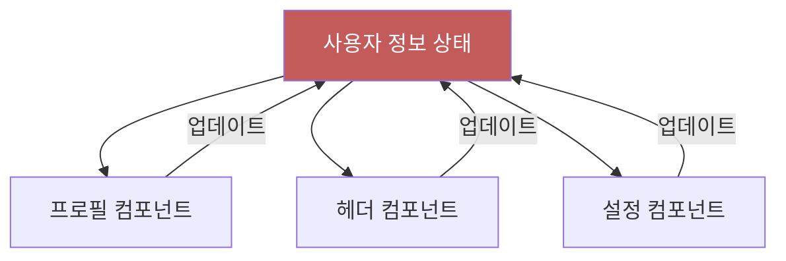
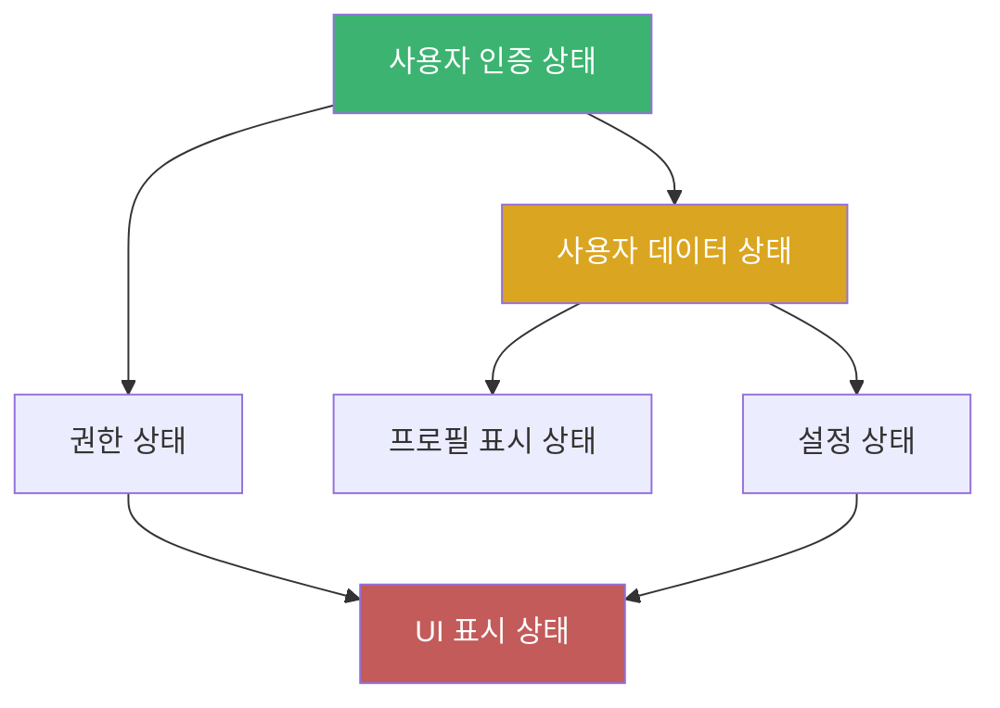
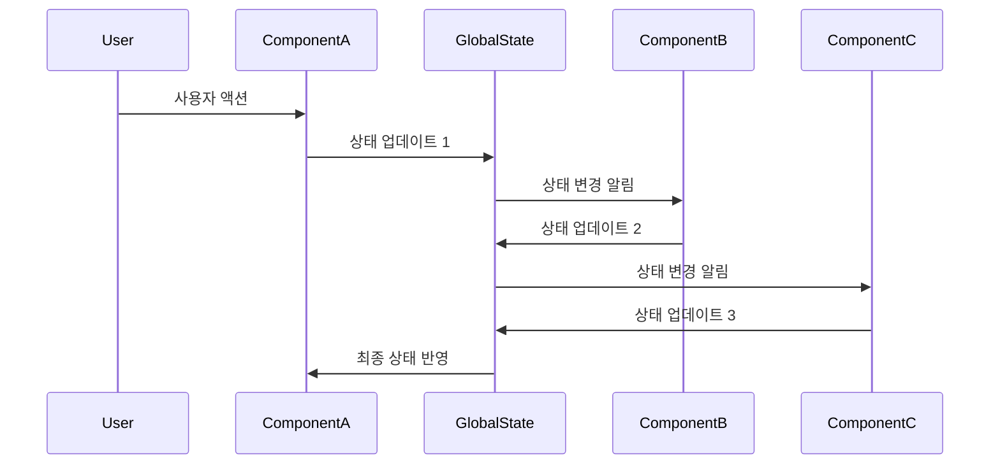
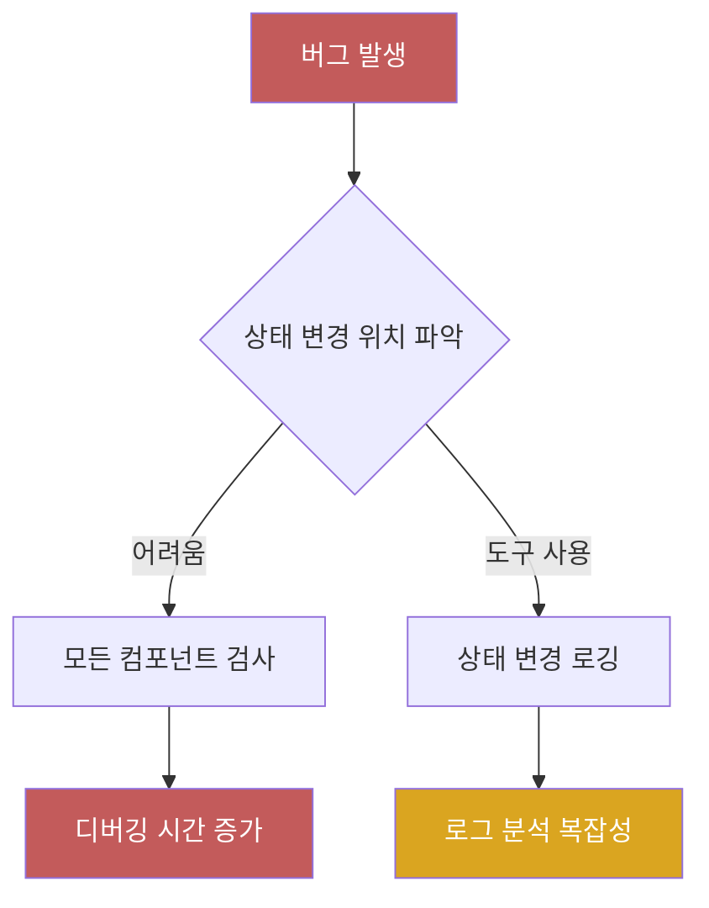
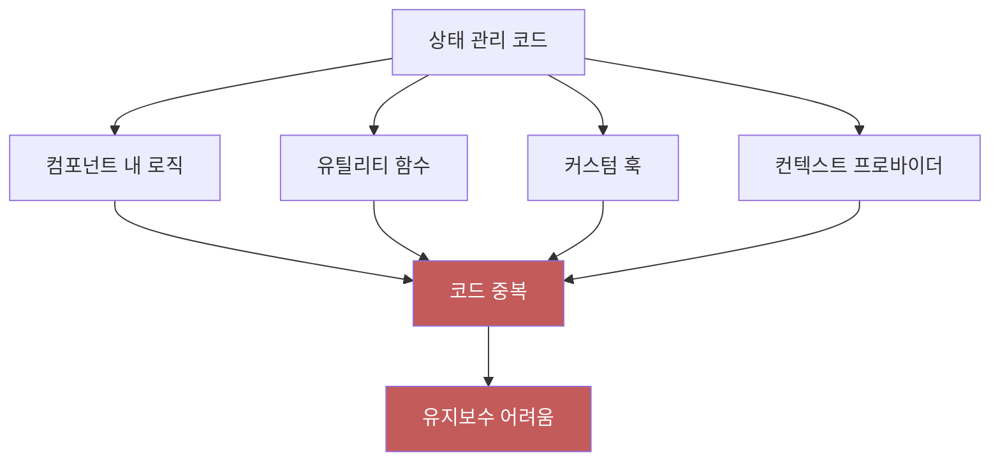

# Chapter 01 상태 관리 소개

## 01-2 상태 관리의 문제점

### 개요
상태 관리는 현대 프론트엔드 애플리케이션 개발에서 필수적인 부분이지만, 여러 가지 도전과 문제점을 수반합니다. 이 섹션에서는 상태 관리 과정에서 발생하는 주요 문제점들과 이로 인한 개발 복잡성 증가에 대해 알아봅니다.

### 상태 일관성 유지의 어려움

애플리케이션이 복잡해질수록 여러 컴포넌트에서 동일한 상태를 참조하고 수정하게 됩니다. 이 과정에서 상태의 일관성을 유지하는 것은 매우 어려운 과제입니다.



위 다이어그램에서 볼 수 있듯이, 여러 컴포넌트가 동일한 상태를 업데이트할 때 다음과 같은 문제가 발생할 수 있습니다:

1. **경쟁 상태(Race Condition)**: 여러 컴포넌트가 동시에 상태를 업데이트하려고 할 때 발생
2. **부분 업데이트**: 한 컴포넌트가 상태의 일부만 업데이트하여 다른 부분이 손실되는 경우
3. **동기화 문제**: 상태 업데이트가 모든 컴포넌트에 즉시 반영되지 않는 경우

#### 해결 방안의 복잡성

이러한 문제를 해결하기 위해 개발자들은 복잡한 상태 동기화 메커니즘을 구현해야 하는데, 이는 코드의 복잡성을 증가시키고 버그 발생 가능성을 높입니다.

```jsx
// 복잡한 상태 동기화 예시
function ProfileComponent() {
  const [localUserData, setLocalUserData] = useState(globalUserData);
  
  useEffect(() => {
    // 전역 상태 변경 감지 및 로컬 상태 업데이트
    const unsubscribe = subscribeToGlobalUserData(data => {
      setLocalUserData(data);
    });
    
    return () => unsubscribe();
  }, []);
  
  const updateUserData = (newData) => {
    // 로컬 상태 업데이트
    setLocalUserData(newData);
    
    // 전역 상태 업데이트
    updateGlobalUserData(newData);
  };
  
  // ...
}
```

### 복잡한 상태 의존성

애플리케이션에서 상태 간의 의존성이 복잡해질수록 상태 관리는 더욱 어려워집니다.



#### 파생 상태 관리

하나의 상태 변경이 여러 파생 상태에 영향을 미치는 경우, 이러한 의존성을 추적하고 관리하는 것은 매우 복잡합니다.

```jsx
// 복잡한 상태 의존성 예시
function calculateDerivedStates(baseState) {
  const userPermissions = baseState.user.role === 'admin' 
    ? ['read', 'write', 'delete'] 
    : baseState.user.role === 'editor' 
      ? ['read', 'write'] 
      : ['read'];
      
  const uiConfig = {
    showAdminPanel: userPermissions.includes('delete'),
    showEditButtons: userPermissions.includes('write'),
    theme: baseState.user.preferences.theme || 'default',
    // ... 더 많은 파생 상태
  };
  
  return {
    permissions: userPermissions,
    ui: uiConfig,
    // ... 더 많은 파생 상태
  };
}
```

### 예측 불가능한 상태 변경

상태 변경 로직이 애플리케이션 전체에 분산되어 있으면, 특정 액션이 어떤 상태 변화를 일으킬지 예측하기 어려워집니다.



위 시퀀스 다이어그램은 하나의 사용자 액션이 여러 컴포넌트를 거쳐 예측하기 어려운 상태 변화를 일으키는 과정을 보여줍니다.

#### 부작용(Side Effects) 관리

상태 변경이 다른 부작용을 트리거하는 경우, 이러한 연쇄 반응을 추적하고 디버깅하는 것은 매우 어렵습니다.

```jsx
// 예측하기 어려운 상태 변경과 부작용
function handleUserAction(action) {
  // 직접적인 상태 변경
  updateUserState(action.userData);
  
  // 부작용 1: 로컬 스토리지 업데이트
  localStorage.setItem('userData', JSON.stringify(action.userData));
  
  // 부작용 2: 관련 상태 업데이트
  if (action.userData.role !== currentUserData.role) {
    updatePermissions(getUserPermissions(action.userData.role));
  }
  
  // 부작용 3: API 호출
  if (action.userData.preferences.notifications !== currentUserData.preferences.notifications) {
    updateNotificationSettings(action.userData.preferences.notifications);
  }
  
  // ... 더 많은 부작용
}
```

### 디버깅의 어려움

상태 관리가 복잡해질수록 버그를 찾고 수정하는 것이 어려워집니다.

#### 상태 변경 추적의 어려움

여러 컴포넌트에서 상태를 변경할 수 있는 경우, 특정 상태 변경이 어디서 발생했는지 추적하기 어렵습니다.



#### 시간에 따른 상태 변화 이해

애플리케이션의 상태가 시간에 따라 어떻게 변화했는지 이해하는 것은 복잡한 상태 관리 시스템에서 특히 어렵습니다.

```jsx
// 디버깅을 위한 상태 로깅 시도
let stateHistory = [];

function updateState(newState) {
  const timestamp = new Date().toISOString();
  const previousState = currentState;
  
  // 상태 업데이트
  currentState = { ...currentState, ...newState };
  
  // 디버깅을 위한 상태 변경 기록
  stateHistory.push({
    timestamp,
    previousState,
    newState: { ...currentState },
    stackTrace: new Error().stack
  });
  
  // 히스토리 크기 제한
  if (stateHistory.length > 100) {
    stateHistory.shift();
  }
  
  notifyListeners();
}
```

### 코드 유지보수 문제

상태 관리 로직이 애플리케이션 전체에 분산되어 있으면 코드 유지보수가 어려워집니다.



#### 상태 관리 패턴의 일관성 부재

일관된 상태 관리 패턴이 없으면, 개발자마다 다른 방식으로 상태를 관리하게 되어 코드 이해와 유지보수가 어려워집니다.

```jsx
// 컴포넌트 A의 상태 관리 방식
function ComponentA() {
  const [state, setState] = useState(initialState);
  
  const updateState = (newData) => {
    setState({ ...state, ...newData });
  };
  
  // ...
}

// 컴포넌트 B의 다른 상태 관리 방식
function ComponentB() {
  const state = useContext(StateContext);
  const dispatch = useContext(DispatchContext);
  
  const updateState = (newData) => {
    dispatch({ type: 'UPDATE', payload: newData });
  };
  
  // ...
}

// 컴포넌트 C의 또 다른 상태 관리 방식
function ComponentC() {
  const { data, mutate } = useSWR('/api/data', fetcher);
  
  const updateState = async (newData) => {
    await fetch('/api/data', {
      method: 'PUT',
      body: JSON.stringify(newData)
    });
    mutate();
  };
  
  // ...
}
```

### 5가지 키워드로 정리하는 핵심 포인트
1. **일관성(Consistency)**: 여러 컴포넌트에서 동일한 상태를 참조하고 수정할 때 상태의 일관성을 유지하기 어렵습니다.
2. **의존성(Dependency)**: 상태 간의 복잡한 의존성은 상태 관리를 더욱 어렵게 만들고 예측하기 어려운 결과를 초래합니다.
3. **예측 가능성(Predictability)**: 상태 변경 로직이 분산되면 특정 액션이 어떤 상태 변화를 일으킬지 예측하기 어려워집니다.
4. **디버깅(Debugging)**: 복잡한 상태 관리 시스템에서는 버그를 찾고 수정하는 것이 매우 어려워집니다.
5. **유지보수성(Maintainability)**: 일관된 상태 관리 패턴 없이는 코드 유지보수가 어려워지고 개발 효율성이 저하됩니다.

### 확인 문제
1. 상태 관리에서 발생하는 주요 문제점이 아닌 것은?
    - [ ] 여러 컴포넌트에서 동일한 상태를 수정할 때의 일관성 문제
    - [ ] 상태 간 복잡한 의존성으로 인한 관리 어려움
    - [ ] 상태 변경 추적 및 디버깅의 어려움
    - [ ] 서버와의 데이터 동기화 속도 저하
    
2. 다음 중 '경쟁 상태(Race Condition)'에 대한 설명으로 가장 적절한 것은?
    - [ ] 여러 컴포넌트가 동시에 상태를 업데이트하려고 할 때 발생하는 문제
    - [ ] 상태 업데이트가 너무 빈번하게 발생하여 성능이 저하되는 현상
    - [ ] 두 개의 상태가 서로 의존하여 순환 참조가 발생하는 상황
    - [ ] 컴포넌트 간 상태 전달이 너무 많은 계층을 거쳐 일어나는 현상

3. 상태 관리의 복잡성을 증가시키는 요인으로 볼 수 있는 것은? (복수 응답)
    - [ ] 상태 변경 로직이 애플리케이션 전체에 분산됨
    - [ ] 하나의 상태 변경이 여러 파생 상태에 영향을 미침
    - [ ] 컴포넌트마다 다른 상태 관리 패턴 사용
    - [ ] 상태 변경에 따른 부작용(Side Effects) 발생
    - [ ] 컴포넌트의 재사용성 증가

> [정답 및 해설 보기](../answers_and_explanations.md#01-2-상태-관리의-문제점)
