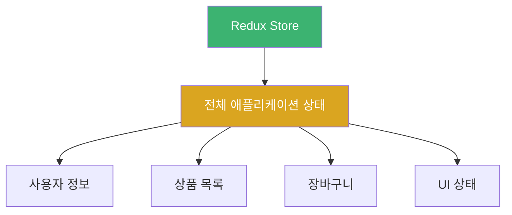
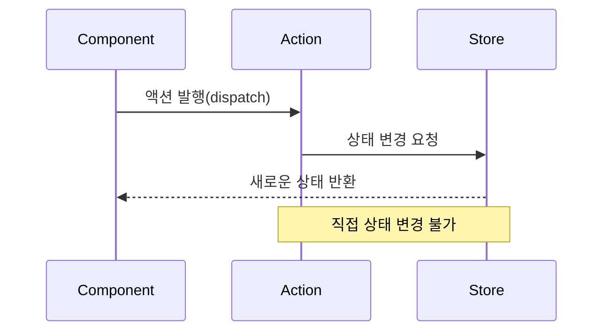
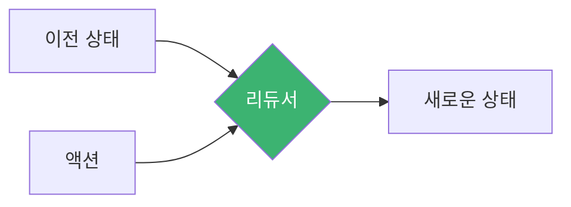
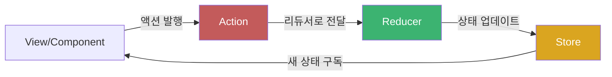
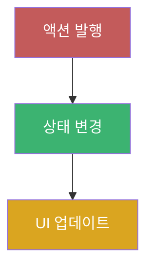
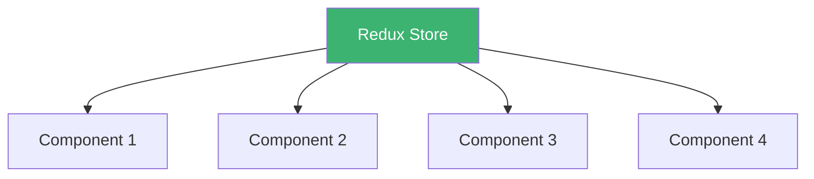
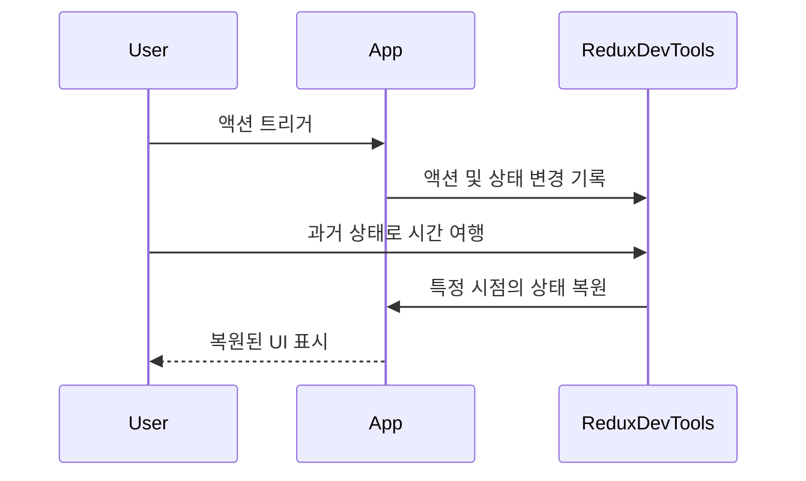
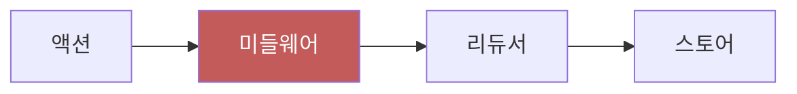

# Chapter 01 상태 관리 소개

## 01-3 Redux 소개

### 개요
Redux는 JavaScript 애플리케이션의 상태 관리를 위한 예측 가능한 상태 컨테이너입니다. Facebook의 Flux 아키텍처에서 영감을 받아 Dan Abramov와 Andrew Clark에 의해 개발되었으며, React와 함께 사용하기 위해 설계되었지만 Angular, Vue 등 다른 프레임워크와도 함께 사용할 수 있습니다. 이 섹션에서는 Redux의 핵심 개념, 특징, 그리고 이를 사용하는 이유에 대해 알아봅니다.

### Redux의 핵심 원칙

Redux는 세 가지 핵심 원칙을 기반으로 합니다:

#### 단일 진리의 원천 (Single Source of Truth)

애플리케이션의 모든 상태는 하나의 스토어(store)라는 객체 트리에 저장됩니다. 이는 상태의 일관성을 유지하고 디버깅을 용이하게 합니다.



#### 상태는 읽기 전용 (State is Read-Only)

상태를 변경하는 유일한 방법은 무슨 일이 벌어졌는지를 나타내는 액션(action)을 발행(dispatch)하는 것입니다. 이는 상태 변경의 예측 가능성을 높이고 의도하지 않은 변경을 방지합니다.



#### 변경은 순수 함수로 작성 (Changes are Made with Pure Functions)

상태 트리가 어떻게 변경되는지를 지정하기 위해 순수 함수인 리듀서(reducer)를 작성합니다. 리듀서는 이전 상태와 액션을 받아 새로운 상태를 반환합니다.



### Redux의 데이터 흐름

Redux는 단방향 데이터 흐름을 따릅니다. 이는 애플리케이션의 데이터가 한 방향으로만 흐르도록 하여 예측 가능성을 높입니다.



1. 사용자가 UI와 상호작용하면 컴포넌트는 액션을 발행합니다.
2. 액션은 리듀서로 전달됩니다.
3. 리듀서는 이전 상태와 액션을 기반으로 새로운 상태를 계산합니다.
4. 스토어는 새로운 상태를 저장하고, 구독 중인 컴포넌트에 알립니다.
5. 컴포넌트는 새로운 상태를 받아 UI를 업데이트합니다.

### Redux의 주요 구성 요소

#### 액션 (Actions)

액션은 애플리케이션에서 스토어로 데이터를 보내는 정보 패킷입니다. 액션은 일반 JavaScript 객체이며, 반드시 `type` 속성을 가져야 합니다.

```jsx
// 액션 예시
const addTodoAction = {
  type: 'ADD_TODO',
  payload: {
    id: 1,
    text: 'Redux 학습하기',
    completed: false
  }
};
```

#### 액션 생성자 (Action Creators)

액션 생성자는 액션을 생성하는 함수입니다. 이를 통해 액션 생성 로직을 재사용할 수 있습니다.

```jsx
// 액션 생성자 예시
function addTodo(text) {
  return {
    type: 'ADD_TODO',
    payload: {
      id: nextTodoId++,
      text,
      completed: false
    }
  };
}
```

#### 리듀서 (Reducers)

리듀서는 현재 상태와 액션을 받아 새로운 상태를 반환하는 순수 함수입니다.

```jsx
// 리듀서 예시
function todosReducer(state = [], action) {
  switch (action.type) {
    case 'ADD_TODO':
      return [
        ...state,
        action.payload
      ];
    case 'TOGGLE_TODO':
      return state.map(todo =>
        todo.id === action.payload.id
          ? { ...todo, completed: !todo.completed }
          : todo
      );
    default:
      return state;
  }
}
```

#### 스토어 (Store)

스토어는 애플리케이션의 상태를 보관하는 객체입니다. Redux 애플리케이션에는 단 하나의 스토어만 존재합니다.

```jsx
// 스토어 생성 예시
import { createStore } from 'redux';
import rootReducer from './reducers';

const store = createStore(rootReducer);
```

### Redux의 장점

#### 예측 가능한 상태 관리

Redux의 단방향 데이터 흐름과 불변성 원칙은 상태 변화를 예측 가능하게 만들어 디버깅과 테스트를 용이하게 합니다.



#### 중앙 집중식 상태 관리

모든 상태가 하나의 스토어에 저장되므로, 상태 관리가 중앙 집중화되어 애플리케이션의 복잡성이 감소합니다.



#### 디버깅 용이성

Redux는 시간 여행 디버깅, 상태 지속성, 로깅 등 강력한 개발자 도구를 제공합니다.



#### 미들웨어를 통한 확장성

Redux 미들웨어를 사용하면 비동기 작업, 로깅, 라우팅 등 다양한 기능을 확장할 수 있습니다.



### Redux 사용 시 고려사항

Redux는 모든 애플리케이션에 적합한 것은 아닙니다. 다음과 같은 경우에 Redux 사용을 고려해볼 수 있습니다:

1. 애플리케이션의 여러 부분에서 공유해야 하는 상당한 양의 상태가 있는 경우
2. 상태가 자주 업데이트되는 경우
3. 상태 업데이트 로직이 복잡한 경우
4. 중간 또는 대규모 코드베이스를 가진 경우
5. 상태 변경 내역을 추적해야 하는 경우

작은 애플리케이션이나 단순한 상태 관리만 필요한 경우에는 React의 Context API와 useReducer 훅 조합이나 다른 경량 상태 관리 라이브러리를 고려할 수 있습니다.

### 간단한 Redux 예제

다음은 간단한 카운터 애플리케이션의 Redux 구현 예시입니다:

```jsx
// 액션 타입 정의
const INCREMENT = 'INCREMENT';
const DECREMENT = 'DECREMENT';

// 액션 생성자
const increment = () => ({ type: INCREMENT });
const decrement = () => ({ type: DECREMENT });

// 초기 상태
const initialState = { count: 0 };

// 리듀서
function counterReducer(state = initialState, action) {
  switch (action.type) {
    case INCREMENT:
      return { count: state.count + 1 };
    case DECREMENT:
      return { count: state.count - 1 };
    default:
      return state;
  }
}

// 스토어 생성
const store = createStore(counterReducer);

// 상태 변경 구독
store.subscribe(() => console.log(store.getState()));

// 액션 발행
store.dispatch(increment()); // { count: 1 }
store.dispatch(increment()); // { count: 2 }
store.dispatch(decrement()); // { count: 1 }
```

### 4가지 키워드로 정리하는 핵심 포인트
1. **단일 스토어(Single Store)**: Redux는 애플리케이션의 모든 상태를 하나의 스토어에 저장하여 상태 관리를 중앙 집중화합니다.
2. **불변성(Immutability)**: Redux에서 상태는 직접 변경되지 않고, 항상 새로운 상태 객체를 반환하여 예측 가능성을 높입니다.
3. **단방향 데이터 흐름(Unidirectional Data Flow)**: 데이터는 항상 액션 → 리듀서 → 스토어 → 뷰의 한 방향으로만 흐릅니다.
4. **순수 함수(Pure Functions)**: 리듀서는 순수 함수로, 동일한 입력에 대해 항상 동일한 출력을 반환하며 부작용이 없습니다.

### 확인 문제
1. Redux의 핵심 원칙이 아닌 것은?
    - [ ] 단일 진리의 원천(Single Source of Truth)
    - [ ] 상태는 읽기 전용(State is Read-Only)
    - [ ] 변경은 순수 함수로 작성(Changes are Made with Pure Functions)
    - [ ] 양방향 데이터 바인딩(Two-way Data Binding)

2. Redux에서 상태를 변경하는 올바른 방법은?
    - [ ] 스토어의 상태를 직접 수정한다
    - [ ] 액션을 발행(dispatch)하여 리듀서가 새 상태를 생성하도록 한다
    - [ ] 컴포넌트에서 상태를 직접 업데이트한다
    - [ ] 미들웨어를 사용하여 상태를 비동기적으로 수정한다

3. Redux를 사용하는 것이 적합한 경우는? (복수 응답)
    - [ ] 애플리케이션의 여러 부분에서 공유해야 하는 상당한 양의 상태가 있는 경우
    - [ ] 상태 업데이트 로직이 복잡한 경우
    - [ ] 모든 소규모 애플리케이션
    - [ ] 상태 변경 내역을 추적해야 하는 경우
    - [ ] 단순한 폼 상태만 관리하는 경우

> [정답 및 해설 보기](../answers_and_explanations.md#01-3-redux-소개)
