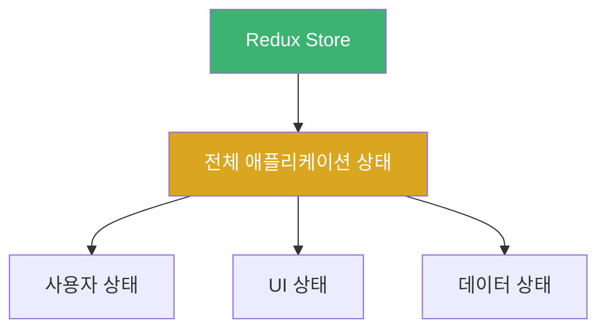
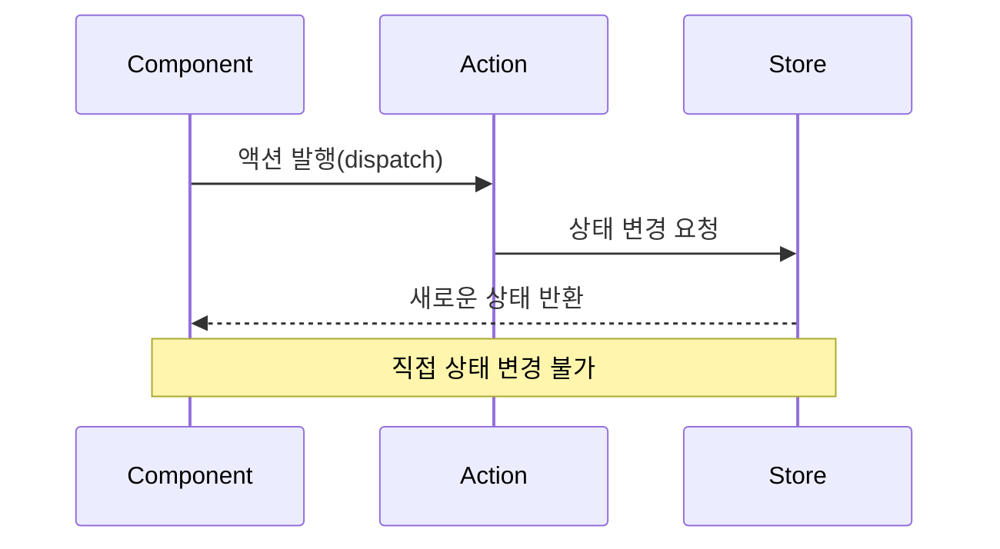
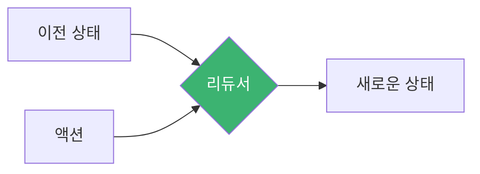
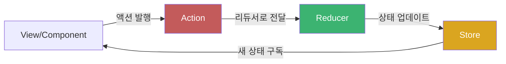
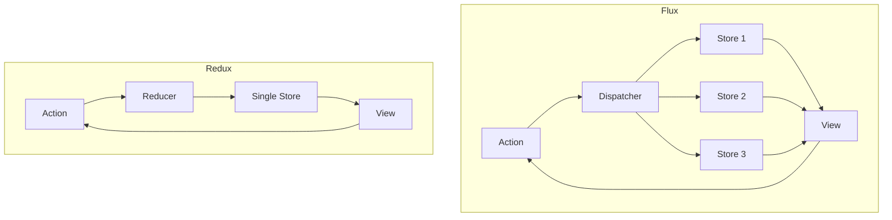
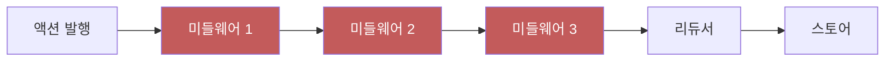

# Chapter 02 Redux 기초

## 02-1 Redux 아키텍처

### 개요
Redux는 JavaScript 애플리케이션의 상태를 관리하기 위한 예측 가능한 상태 컨테이너입니다. 이 섹션에서는 Redux의 핵심 아키텍처 원칙과 데이터 흐름에 대해 알아보고, 이를 통해 Redux가 어떻게 복잡한 상태 관리 문제를 해결하는지 이해합니다.

### Redux 아키텍처의 핵심 원칙

Redux는 세 가지 핵심 원칙을 기반으로 설계되었으며, 이 원칙들은 Redux의 아키텍처를 이해하는 데 필수적입니다.

#### 단일 진리의 원천 (Single Source of Truth)

Redux에서는 애플리케이션의 전체 상태가 하나의 스토어(store)라는 객체 트리에 저장됩니다. 이는 상태 관리를 중앙 집중화하여 다음과 같은 이점을 제공합니다:

- 애플리케이션의 상태를 쉽게 추적하고 관리할 수 있습니다.
- 디버깅이 용이해집니다.
- 서버 상태와 클라이언트 상태를 쉽게 직렬화하고 복원할 수 있습니다.



단일 스토어 접근 방식은 상태의 일관성을 유지하고, 여러 컴포넌트에서 동일한 상태에 접근할 때 발생할 수 있는 동기화 문제를 방지합니다.

```jsx
// Redux 스토어 생성 예시
import { createStore } from 'redux';
import rootReducer from './reducers';

const store = createStore(rootReducer);
```

#### 상태는 읽기 전용 (State is Read-Only)

Redux에서 상태는 직접 변경할 수 없습니다. 상태를 변경하는 유일한 방법은 무슨 일이 일어났는지를 설명하는 액션(action) 객체를 발행(dispatch)하는 것입니다.

이 원칙은 다음과 같은 이점을 제공합니다:
- 상태 변경이 예측 가능해집니다.
- 의도하지 않은 상태 변경을 방지합니다.
- 시간 여행 디버깅과 같은 고급 기능을 가능하게 합니다.



```jsx
// 액션 발행 예시
const addTodoAction = {
  type: 'ADD_TODO',
  payload: { id: 1, text: 'Redux 학습하기', completed: false }
};

store.dispatch(addTodoAction);
```

#### 변경은 순수 함수로 작성 (Changes are Made with Pure Functions)

상태 변경을 처리하는 함수를 리듀서(reducer)라고 하며, 이는 이전 상태와 액션을 받아 새로운 상태를 반환하는 순수 함수입니다.

순수 함수의 특징:
- 동일한 입력에 대해 항상 동일한 출력을 반환합니다.
- 부작용(side effects)이 없습니다.
- 외부 상태를 변경하지 않습니다.



```jsx
// 리듀서 예시
function todoReducer(state = [], action) {
  switch (action.type) {
    case 'ADD_TODO':
      return [...state, action.payload];
    case 'TOGGLE_TODO':
      return state.map(todo =>
        todo.id === action.payload.id
          ? { ...todo, completed: !todo.completed }
          : todo
      );
    default:
      return state;
  }
}
```

### Redux의 단방향 데이터 흐름

Redux는 단방향 데이터 흐름(Unidirectional Data Flow)을 따릅니다. 이는 애플리케이션의 데이터가 한 방향으로만 흐르도록 하여 상태 변화를 예측 가능하게 만듭니다.



Redux의 데이터 흐름은 다음과 같은 단계로 이루어집니다:

1. **액션 발행**: 사용자 상호작용이나 API 호출 등의 이벤트가 발생하면, 컴포넌트는 액션을 발행합니다.
2. **리듀서 처리**: 발행된 액션은 리듀서로 전달되어 처리됩니다.
3. **상태 업데이트**: 리듀서는 이전 상태와 액션을 기반으로 새로운 상태를 계산하고 반환합니다.
4. **구독자 알림**: 스토어는 새로운 상태를 저장하고, 이를 구독하고 있는 모든 컴포넌트에 알립니다.
5. **UI 업데이트**: 컴포넌트는 새로운 상태를 받아 UI를 업데이트합니다.

이러한 단방향 데이터 흐름은 상태 변화를 추적하기 쉽게 만들고, 애플리케이션의 동작을 예측 가능하게 합니다.

```jsx
// Redux 데이터 흐름 예시
// 1. 액션 생성자
const addTodo = (text) => ({
  type: 'ADD_TODO',
  payload: { id: Date.now(), text, completed: false }
});

// 2. 컴포넌트에서 액션 발행
function TodoForm() {
  const dispatch = useDispatch();
  const [text, setText] = useState('');
  
  const handleSubmit = (e) => {
    e.preventDefault();
    dispatch(addTodo(text)); // 액션 발행
    setText('');
  };
  
  // ...
}

// 3. 리듀서에서 상태 업데이트
function todoReducer(state = [], action) {
  switch (action.type) {
    case 'ADD_TODO':
      return [...state, action.payload];
    // ...
    default:
      return state;
  }
}

// 4. 컴포넌트에서 상태 구독 및 UI 업데이트
function TodoList() {
  const todos = useSelector(state => state.todos); // 상태 구독
  
  return (
    <ul>
      {todos.map(todo => (
        <li key={todo.id}>{todo.text}</li>
      ))}
    </ul>
  );
}
```

### Redux와 Flux 아키텍처

Redux는 Facebook의 Flux 아키텍처에서 영감을 받았지만, 몇 가지 중요한 차이점이 있습니다.



#### 주요 차이점

1. **단일 스토어**: Flux는 여러 스토어를 가질 수 있지만, Redux는 단일 스토어만 사용합니다.
2. **리듀서**: Flux에는 리듀서 개념이 없지만, Redux는 리듀서를 통해 상태 변경 로직을 관리합니다.
3. **불변성**: Redux는 상태의 불변성을 강조하지만, Flux는 이에 대한 명확한 규칙이 없습니다.
4. **단순성**: Redux는 Flux보다 더 단순한 API와 개념을 제공합니다.

### Redux 아키텍처의 확장

Redux의 기본 아키텍처는 미들웨어(middleware)를 통해 확장할 수 있습니다. 미들웨어는 액션이 디스패치되어 리듀서에 도달하기 전에 가로채서 추가 작업을 수행할 수 있게 해줍니다.



미들웨어는 다음과 같은 기능을 구현하는 데 사용됩니다:

- 로깅
- 비동기 작업 (API 호출 등)
- 라우팅
- 크래시 리포팅
- 분석(analytics)

```jsx
// 미들웨어 예시 (로깅)
const loggerMiddleware = store => next => action => {
  console.log('이전 상태:', store.getState());
  console.log('액션:', action);
  const result = next(action);
  console.log('다음 상태:', store.getState());
  return result;
};

// 미들웨어 적용
import { createStore, applyMiddleware } from 'redux';
import rootReducer from './reducers';
import thunk from 'redux-thunk'; // 비동기 작업을 위한 미들웨어

const store = createStore(
  rootReducer,
  applyMiddleware(thunk, loggerMiddleware)
);
```

### 5가지 키워드로 정리하는 핵심 포인트
1. **단일 스토어(Single Store)**: Redux는 애플리케이션의 모든 상태를 하나의 객체 트리에 저장하여 상태 관리를 중앙 집중화합니다.
2. **불변성(Immutability)**: Redux에서 상태는 직접 변경할 수 없으며, 새로운 상태 객체를 생성하여 변경사항을 반영합니다.
3. **순수 함수(Pure Functions)**: 리듀서는 순수 함수로, 동일한 입력에 대해 항상 동일한 출력을 반환하며 부작용이 없습니다.
4. **단방향 데이터 흐름(Unidirectional Data Flow)**: 데이터는 항상 액션 → 리듀서 → 스토어 → 뷰의 한 방향으로만 흐릅니다.
5. **예측 가능성(Predictability)**: Redux의 아키텍처는 상태 변화를 예측 가능하게 만들어 디버깅과 테스트를 용이하게 합니다.

### 확인 문제
1. Redux 아키텍처의 핵심 원칙이 아닌 것은?
    - [ ] 단일 진리의 원천(Single Source of Truth)
    - [ ] 상태는 읽기 전용(State is Read-Only)
    - [ ] 변경은 순수 함수로 작성(Changes are Made with Pure Functions)
    - [ ] 양방향 데이터 바인딩(Two-way Data Binding)

2. Redux의 데이터 흐름 순서로 올바른 것은?
    - [ ] 리듀서 → 액션 → 스토어 → 뷰
    - [ ] 액션 → 리듀서 → 스토어 → 뷰
    - [ ] 뷰 → 스토어 → 리듀서 → 액션
    - [ ] 스토어 → 액션 → 리듀서 → 뷰

3. Redux 아키텍처의 장점으로 볼 수 있는 것은? (복수 응답)
    - [ ] 상태 변화의 예측 가능성 증가
    - [ ] 디버깅 용이성
    - [ ] 상태 관리 코드의 중앙 집중화
    - [ ] 양방향 데이터 바인딩 지원
    - [ ] 시간 여행 디버깅 가능

> [정답 및 해설 보기](../answers_and_explanations.md#02-1-redux-아키텍처)
