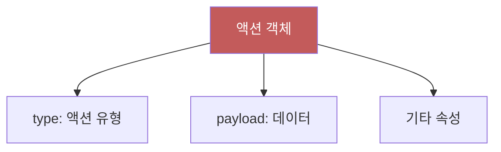
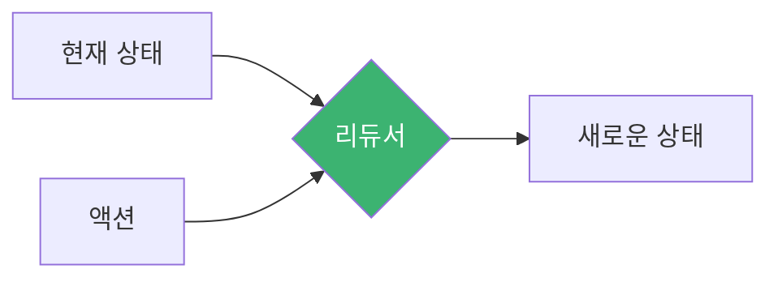
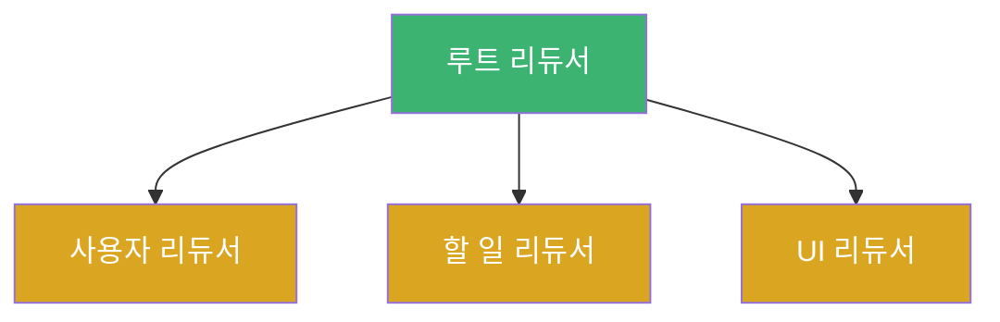
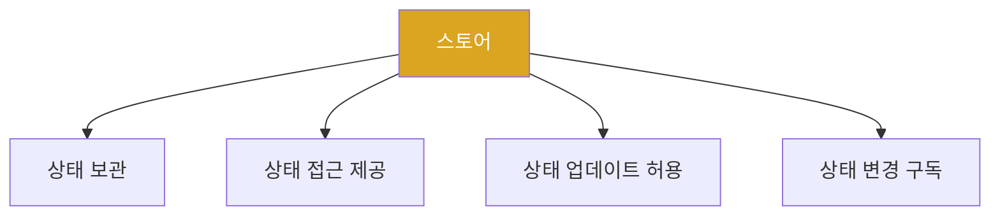
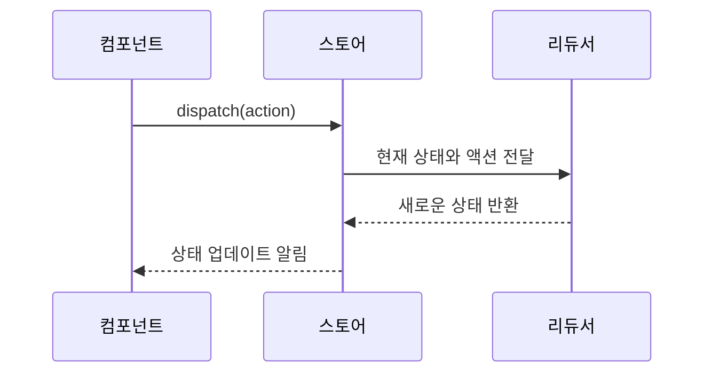
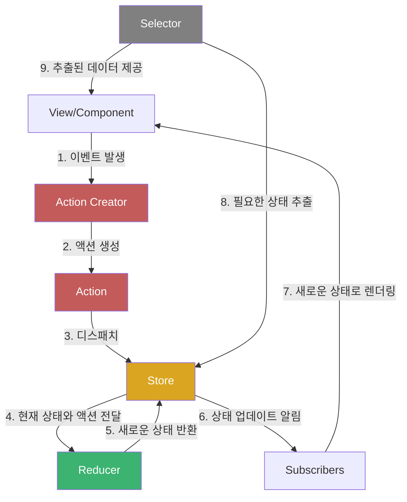

# Chapter 02 Redux 기초

## 02-2 Redux 핵심 개념

### 개요
Redux는 JavaScript 애플리케이션의 상태 관리를 위한 라이브러리로, 몇 가지 핵심 개념을 기반으로 합니다. 이 섹션에서는 Redux의 주요 구성 요소인 액션(Action), 리듀서(Reducer), 스토어(Store), 디스패치(Dispatch), 셀렉터(Selector)에 대해 자세히 알아보고, 이들이 어떻게 함께 작동하여 예측 가능한 상태 관리를 가능하게 하는지 이해합니다.

### 액션(Action)

액션은 애플리케이션에서 스토어로 데이터를 보내는 정보 패킷입니다. 액션은 Redux 애플리케이션에서 상태 변경을 일으키는 유일한 방법입니다.

#### 액션의 구조

액션은 일반적으로 다음과 같은 구조를 가진 JavaScript 객체입니다:

```javascript
{
  type: 'ADD_TODO',
  payload: {
    id: 1,
    text: 'Redux 학습하기',
    completed: false
  }
}
```

액션 객체의 주요 속성:
- **type**: 액션의 유형을 나타내는 문자열 (필수)
- **payload**: 액션과 함께 전달되는 데이터 (선택)
- 기타 필요한 속성들



#### 액션 생성자(Action Creator)

액션 생성자는 액션 객체를 생성하는 함수입니다. 액션 생성자를 사용하면 액션 생성 로직을 재사용할 수 있고, 액션 생성 과정을 추상화할 수 있습니다.

```javascript
// 액션 생성자 예시
const addTodo = (text) => {
  return {
    type: 'ADD_TODO',
    payload: {
      id: Date.now(),
      text,
      completed: false
    }
  };
};

// 액션 생성자 사용
const action = addTodo('Redux 학습하기');
```

액션 생성자를 사용하면 다음과 같은 이점이 있습니다:
- 코드 재사용성 향상
- 액션 생성 로직 중앙화
- 테스트 용이성

### 리듀서(Reducer)

리듀서는 현재 상태와 액션을 받아 새로운 상태를 반환하는 순수 함수입니다. 리듀서는 상태 변경 로직을 담당합니다.

#### 리듀서의 특징

1. **순수 함수**: 동일한 입력에 대해 항상 동일한 출력을 반환하며, 부작용이 없어야 합니다.
2. **불변성 유지**: 기존 상태를 직접 수정하지 않고, 새로운 상태 객체를 생성하여 반환합니다.
3. **예측 가능성**: 상태 변경이 명확하고 추적 가능합니다.



#### 리듀서 구현 예시

```javascript
// 초기 상태
const initialState = {
  todos: []
};

// 리듀서 함수
function todoReducer(state = initialState, action) {
  switch (action.type) {
    case 'ADD_TODO':
      return {
        ...state,
        todos: [...state.todos, action.payload]
      };
    
    case 'TOGGLE_TODO':
      return {
        ...state,
        todos: state.todos.map(todo =>
          todo.id === action.payload.id
            ? { ...todo, completed: !todo.completed }
            : todo
        )
      };
    
    case 'DELETE_TODO':
      return {
        ...state,
        todos: state.todos.filter(todo => todo.id !== action.payload.id)
      };
    
    default:
      return state;
  }
}
```

#### 리듀서 조합(Combining Reducers)

대규모 애플리케이션에서는 상태를 여러 부분으로 나누고, 각 부분을 담당하는 리듀서를 만든 후 이를 조합하여 사용합니다. Redux의 `combineReducers` 함수를 사용하면 여러 리듀서를 하나로 조합할 수 있습니다.

```javascript
import { combineReducers } from 'redux';

// 사용자 관련 리듀서
function userReducer(state = {}, action) {
  // 사용자 상태 처리 로직
  return state;
}

// 할 일 관련 리듀서
function todoReducer(state = [], action) {
  // 할 일 상태 처리 로직
  return state;
}

// UI 관련 리듀서
function uiReducer(state = {}, action) {
  // UI 상태 처리 로직
  return state;
}

// 루트 리듀서 생성
const rootReducer = combineReducers({
  user: userReducer,
  todos: todoReducer,
  ui: uiReducer
});
```



이렇게 조합된 리듀서를 사용하면 상태가 다음과 같은 구조를 갖게 됩니다:

```javascript
{
  user: { /* 사용자 상태 */ },
  todos: [ /* 할 일 목록 */ ],
  ui: { /* UI 상태 */ }
}
```

### 스토어(Store)

스토어는 애플리케이션의 상태를 보관하는 객체입니다. Redux 애플리케이션에는 단 하나의 스토어만 존재합니다.

#### 스토어의 역할

1. **상태 보관**: 애플리케이션의 전체 상태 트리를 보관합니다.
2. **상태 접근 제공**: `getState()` 메서드를 통해 현재 상태에 접근할 수 있습니다.
3. **상태 업데이트 허용**: `dispatch(action)` 메서드를 통해 상태를 업데이트할 수 있습니다.
4. **상태 변경 구독**: `subscribe(listener)` 메서드를 통해 상태 변경을 감지하고 반응할 수 있습니다.



#### 스토어 생성

Redux의 `createStore` 함수를 사용하여 스토어를 생성합니다:

```javascript
import { createStore } from 'redux';
import rootReducer from './reducers';

const store = createStore(rootReducer);
```

추가 설정(미들웨어, 초기 상태 등)을 포함하여 스토어를 생성할 수도 있습니다:

```javascript
import { createStore, applyMiddleware } from 'redux';
import thunk from 'redux-thunk';
import rootReducer from './reducers';

const initialState = {
  todos: [
    { id: 1, text: 'Redux 학습하기', completed: false }
  ]
};

const store = createStore(
  rootReducer,
  initialState,
  applyMiddleware(thunk)
);
```

### 디스패치(Dispatch)

디스패치는 스토어의 메서드로, 액션을 스토어로 보내는 과정입니다. 디스패치가 호출되면 스토어는 리듀서 함수를 실행하여 새로운 상태를 계산합니다.

#### 디스패치 사용 예시

```javascript
// 액션 생성자
const addTodo = (text) => ({
  type: 'ADD_TODO',
  payload: { id: Date.now(), text, completed: false }
});

// 액션 디스패치
store.dispatch(addTodo('Redux 학습하기'));
```



### 셀렉터(Selector)

셀렉터는 Redux 상태에서 특정 데이터를 추출하는 함수입니다. 셀렉터를 사용하면 컴포넌트가 필요한 데이터만 선택적으로 가져올 수 있습니다.

#### 셀렉터의 이점

1. **재사용성**: 동일한 상태 선택 로직을 여러 컴포넌트에서 재사용할 수 있습니다.
2. **캡슐화**: 상태 구조의 세부 사항을 컴포넌트로부터 숨길 수 있습니다.
3. **성능 최적화**: 필요한 데이터만 선택하여 불필요한 렌더링을 방지할 수 있습니다.

#### 셀렉터 예시

```javascript
// 기본 셀렉터
const getTodos = state => state.todos;
const getCompletedTodos = state => state.todos.filter(todo => todo.completed);
const getIncompleteTodos = state => state.todos.filter(todo => !todo.completed);

// 셀렉터 사용
const allTodos = getTodos(store.getState());
const completedTodos = getCompletedTodos(store.getState());
```

### Redux 데이터 흐름 종합

Redux의 모든 핵심 개념들이 어떻게 함께 작동하는지 종합적으로 살펴보겠습니다.



전체 데이터 흐름 과정:

1. 사용자 상호작용이나 다른 이벤트가 발생하면 컴포넌트에서 액션 생성자를 호출합니다.
2. 액션 생성자는 액션 객체를 생성합니다.
3. 생성된 액션은 스토어의 `dispatch` 메서드를 통해 디스패치됩니다.
4. 스토어는 현재 상태와 액션을 리듀서에 전달합니다.
5. 리듀서는 현재 상태와 액션을 기반으로 새로운 상태를 계산하고 반환합니다.
6. 스토어는 새로운 상태를 저장하고, 구독자들에게 상태 변경을 알립니다.
7. 구독자(컴포넌트)는 새로운 상태를 받아 필요한 경우 UI를 업데이트합니다.
8. 셀렉터는 스토어에서 필요한 데이터만 추출합니다.
9. 추출된 데이터는 컴포넌트에 제공되어 렌더링에 사용됩니다.

### 실제 사용 예시: 할 일 목록 애플리케이션

Redux의 핵심 개념들이 실제 애플리케이션에서 어떻게 사용되는지 간단한 할 일 목록 애플리케이션을 통해 살펴보겠습니다.

#### 1. 액션 타입 정의

```javascript
// actionTypes.js
export const ADD_TODO = 'ADD_TODO';
export const TOGGLE_TODO = 'TOGGLE_TODO';
export const DELETE_TODO = 'DELETE_TODO';
```

#### 2. 액션 생성자 구현

```javascript
// actions.js
import { ADD_TODO, TOGGLE_TODO, DELETE_TODO } from './actionTypes';

export const addTodo = (text) => ({
  type: ADD_TODO,
  payload: {
    id: Date.now(),
    text,
    completed: false
  }
});

export const toggleTodo = (id) => ({
  type: TOGGLE_TODO,
  payload: { id }
});

export const deleteTodo = (id) => ({
  type: DELETE_TODO,
  payload: { id }
});
```

#### 3. 리듀서 구현

```javascript
// reducer.js
import { ADD_TODO, TOGGLE_TODO, DELETE_TODO } from './actionTypes';

const initialState = {
  todos: []
};

function todoReducer(state = initialState, action) {
  switch (action.type) {
    case ADD_TODO:
      return {
        ...state,
        todos: [...state.todos, action.payload]
      };
    
    case TOGGLE_TODO:
      return {
        ...state,
        todos: state.todos.map(todo =>
          todo.id === action.payload.id
            ? { ...todo, completed: !todo.completed }
            : todo
        )
      };
    
    case DELETE_TODO:
      return {
        ...state,
        todos: state.todos.filter(todo => todo.id !== action.payload.id)
      };
    
    default:
      return state;
  }
}

export default todoReducer;
```

#### 4. 스토어 생성

```javascript
// store.js
import { createStore } from 'redux';
import todoReducer from './reducer';

const store = createStore(todoReducer);

export default store;
```

#### 5. 셀렉터 구현

```javascript
// selectors.js
export const getTodos = state => state.todos;
export const getCompletedTodos = state => state.todos.filter(todo => todo.completed);
export const getIncompleteTodos = state => state.todos.filter(todo => !todo.completed);
```

#### 6. React 컴포넌트에서 사용

```jsx
// TodoApp.js
import React, { useState } from 'react';
import { useSelector, useDispatch } from 'react-redux';
import { addTodo, toggleTodo, deleteTodo } from './actions';
import { getTodos } from './selectors';

function TodoApp() {
  const [text, setText] = useState('');
  const todos = useSelector(getTodos);
  const dispatch = useDispatch();

  const handleSubmit = (e) => {
    e.preventDefault();
    if (!text.trim()) return;
    dispatch(addTodo(text));
    setText('');
  };

  return (
    <div>
      <h1>할 일 목록</h1>
      
      <form onSubmit={handleSubmit}>
        <input
          value={text}
          onChange={(e) => setText(e.target.value)}
          placeholder="할 일을 입력하세요"
        />
        <button type="submit">추가</button>
      </form>
      
      <ul>
        {todos.map(todo => (
          <li key={todo.id}>
            <span
              style={{ textDecoration: todo.completed ? 'line-through' : 'none' }}
              onClick={() => dispatch(toggleTodo(todo.id))}
            >
              {todo.text}
            </span>
            <button onClick={() => dispatch(deleteTodo(todo.id))}>삭제</button>
          </li>
        ))}
      </ul>
    </div>
  );
}

export default TodoApp;
```

### 5가지 키워드로 정리하는 핵심 포인트
1. **액션(Action)**: 상태 변경을 설명하는 정보 패킷으로, `type` 속성을 필수로 가지며 상태 변경에 필요한 데이터를 포함합니다.
2. **리듀서(Reducer)**: 현재 상태와 액션을 받아 새로운 상태를 반환하는 순수 함수로, 상태 변경 로직을 담당합니다.
3. **스토어(Store)**: 애플리케이션의 전체 상태를 보관하는 객체로, 상태 접근, 업데이트, 변경 구독 기능을 제공합니다.
4. **디스패치(Dispatch)**: 액션을 스토어로 보내는 과정으로, 상태 변경을 트리거하는 유일한 방법입니다.
5. **셀렉터(Selector)**: 상태에서 특정 데이터를 추출하는 함수로, 컴포넌트가 필요한 데이터만 선택적으로 가져올 수 있게 합니다.

### 확인 문제
1. Redux에서 상태 변경을 일으키는 유일한 방법은 무엇인가요?
    - [ ] 리듀서 함수를 직접 호출하기
    - [ ] 스토어의 상태를 직접 수정하기
    - [ ] 액션을 디스패치하기
    - [ ] 셀렉터 함수를 사용하기

2. 다음 중 리듀서(Reducer)의 특징으로 올바르지 않은 것은?
    - [ ] 순수 함수여야 한다
    - [ ] 이전 상태를 변경하지 않고 새로운 상태를 반환한다
    - [ ] 비동기 작업을 직접 처리할 수 있다
    - [ ] 동일한 입력에 대해 항상 동일한 출력을 반환한다

3. Redux의 핵심 구성 요소로 올바른 것은? (복수 응답)
    - [ ] 액션(Action)
    - [ ] 리듀서(Reducer)
    - [ ] 스토어(Store)
    - [ ] 옵저버(Observer)
    - [ ] 디스패치(Dispatch)

> [정답 및 해설 보기](../answers_and_explanations.md#02-2-redux-핵심-개념)
