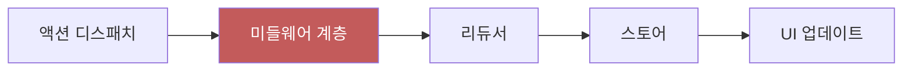
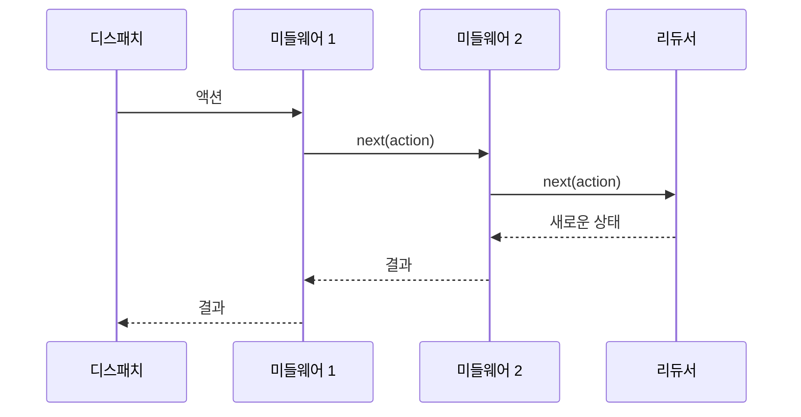
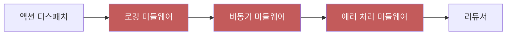
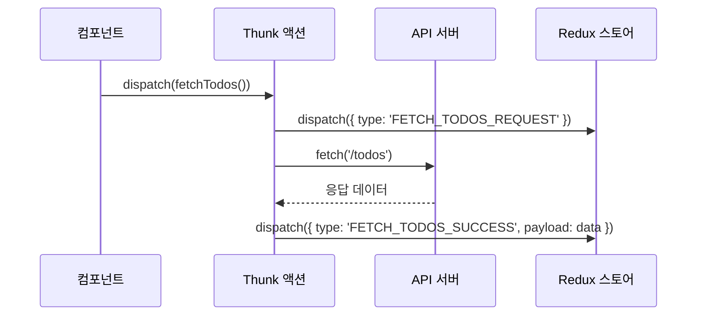
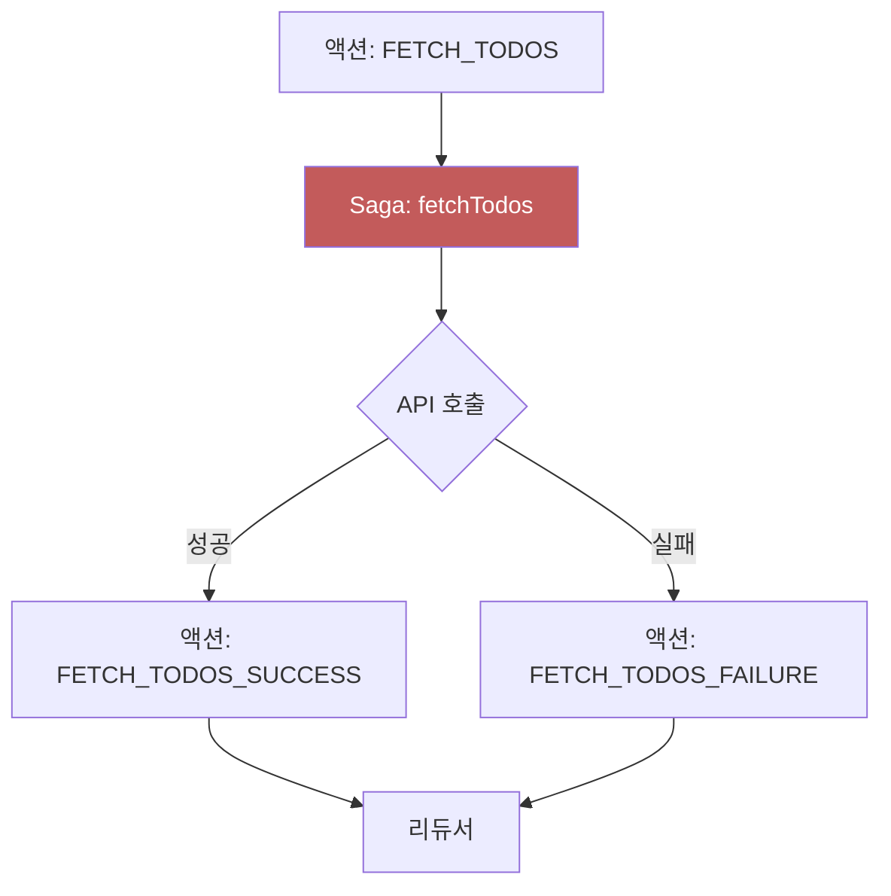
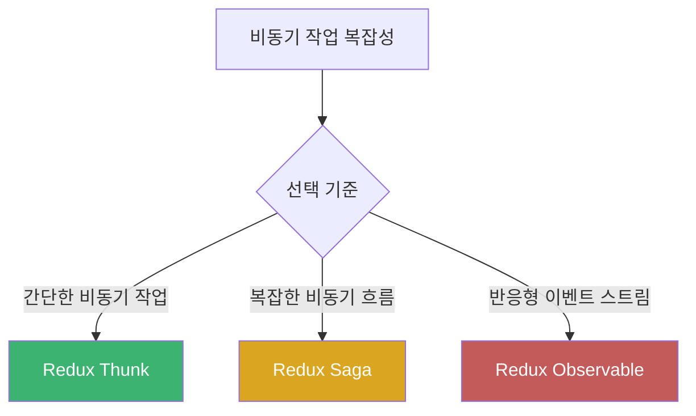

# Chapter 02 Redux 기초

## 02-3 Redux 미들웨어

### 개요
Redux 미들웨어는 액션이 디스패치되어 리듀서에 도달하기 전에 가로채서 추가 작업을 수행할 수 있게 해주는 확장 포인트입니다. 이 섹션에서는 미들웨어의 개념, 작동 방식, 주요 사용 사례를 살펴보고, 비동기 작업 처리와 같은 복잡한 상태 관리 문제를 미들웨어를 통해 어떻게 해결할 수 있는지 이해합니다.

### 미들웨어의 개념과 필요성

Redux의 기본 데이터 흐름은 동기적입니다. 액션이 디스패치되면 리듀서가 즉시 실행되어 새로운 상태를 계산합니다. 그러나 실제 애플리케이션에서는 API 호출, 타이머, 로깅 등 비동기 작업이나 부수 효과(side effects)를 처리해야 하는 경우가 많습니다.

미들웨어는 이러한 복잡한 작업을 처리하기 위한 확장 계층으로, Redux의 기본 동작을 확장하여 다음과 같은 기능을 구현할 수 있게 해줍니다:

- 비동기 API 호출
- 로깅
- 에러 처리
- 라우팅
- 상태 변경 추적
- 캐싱



#### 미들웨어 없이 비동기 작업을 처리하는 경우의 문제점

미들웨어 없이 비동기 작업을 처리하려면 다음과 같은 문제에 직면하게 됩니다:

1. **리듀서의 순수성 위반**: 리듀서는 순수 함수여야 하므로 API 호출과 같은 부수 효과를 직접 수행할 수 없습니다.
2. **복잡한 상태 관리**: 로딩 상태, 성공/실패 상태 등을 수동으로 관리해야 합니다.
3. **코드 중복**: 비슷한 비동기 패턴이 여러 컴포넌트에 중복됩니다.
4. **테스트 어려움**: 비동기 로직이 컴포넌트에 직접 포함되면 테스트하기 어렵습니다.

### 미들웨어의 작동 방식

Redux 미들웨어는 함수를 반환하는 함수를 반환하는 함수(고차 함수)의 형태로 구현됩니다. 이는 함수형 프로그래밍의 커링(currying) 패턴을 활용합니다.

```javascript
// 미들웨어의 기본 형태
const middleware = store => next => action => {
  // 미들웨어 로직
  return next(action);
};
```

이 구조는 다음과 같은 세 가지 계층으로 이루어져 있습니다:

1. `store => ...`: 미들웨어가 Redux 스토어에 접근할 수 있게 합니다.
2. `next => ...`: 다음 미들웨어(또는 리듀서)로 액션을 전달하는 함수입니다.
3. `action => ...`: 처리할 액션 객체입니다.



#### 미들웨어 체인

여러 미들웨어를 함께 사용할 때, 미들웨어는 체인 형태로 연결됩니다. 각 미들웨어는 액션을 처리한 후 다음 미들웨어로 전달하거나, 체인을 중단할 수 있습니다.



### 간단한 미들웨어 구현 예시

#### 로깅 미들웨어

가장 간단한 미들웨어 예시로, 액션과 상태 변화를 로깅하는 미들웨어를 구현해 보겠습니다.

```javascript
// 로깅 미들웨어
const loggerMiddleware = store => next => action => {
  console.log('이전 상태:', store.getState());
  console.log('액션:', action);
  
  // 다음 미들웨어(또는 리듀서)로 액션 전달
  const result = next(action);
  
  console.log('다음 상태:', store.getState());
  return result;
};
```

#### 미들웨어 적용

미들웨어는 Redux 스토어를 생성할 때 `applyMiddleware` 함수를 통해 적용합니다.

```javascript
import { createStore, applyMiddleware } from 'redux';
import rootReducer from './reducers';
import loggerMiddleware from './middleware/logger';

const store = createStore(
  rootReducer,
  applyMiddleware(loggerMiddleware)
);
```

여러 미들웨어를 함께 사용할 경우, 적용 순서가 중요합니다. 미들웨어는 지정된 순서대로 실행됩니다.

```javascript
const store = createStore(
  rootReducer,
  applyMiddleware(
    middleware1,
    middleware2,
    middleware3
  )
);
```

### 주요 Redux 미들웨어 라이브러리

Redux 생태계에는 다양한 미들웨어 라이브러리가 있으며, 각각 특정 문제를 해결하기 위해 설계되었습니다. 가장 널리 사용되는 미들웨어 라이브러리를 살펴보겠습니다.

#### Redux Thunk

Redux Thunk는 가장 기본적이고 널리 사용되는 미들웨어로, 액션 생성자가 액션 객체 대신 함수를 반환할 수 있게 해줍니다. 이 함수는 `dispatch`와 `getState`를 인자로 받아 비동기 작업을 수행할 수 있습니다.

```javascript
// Redux Thunk 설치
// npm install redux-thunk

// 스토어에 적용
import { createStore, applyMiddleware } from 'redux';
import thunk from 'redux-thunk';
import rootReducer from './reducers';

const store = createStore(
  rootReducer,
  applyMiddleware(thunk)
);
```

##### Thunk 액션 생성자 예시

```javascript
// 동기 액션 생성자
const addTodo = (text) => ({
  type: 'ADD_TODO',
  payload: { text, completed: false }
});

// 비동기 액션 생성자 (Thunk)
const fetchTodos = () => {
  return async (dispatch) => {
    dispatch({ type: 'FETCH_TODOS_REQUEST' });
    
    try {
      const response = await fetch('https://api.example.com/todos');
      const data = await response.json();
      dispatch({ type: 'FETCH_TODOS_SUCCESS', payload: data });
    } catch (error) {
      dispatch({ type: 'FETCH_TODOS_FAILURE', error: error.message });
    }
  };
};

// 사용 예시
store.dispatch(addTodo('Redux 학습하기')); // 일반 액션 객체 디스패치
store.dispatch(fetchTodos()); // 함수 디스패치 (Thunk)
```



#### Redux Saga

Redux Saga는 더 복잡한 비동기 흐름을 관리하기 위한 미들웨어로, ES6의 제너레이터 함수를 사용하여 비동기 작업을 선언적으로 관리합니다. 복잡한 비동기 흐름, 동시성 제어, 경쟁 상태 처리 등에 적합합니다.

```javascript
// Redux Saga 설치
// npm install redux-saga

// 스토어에 적용
import { createStore, applyMiddleware } from 'redux';
import createSagaMiddleware from 'redux-saga';
import rootReducer from './reducers';
import rootSaga from './sagas';

const sagaMiddleware = createSagaMiddleware();

const store = createStore(
  rootReducer,
  applyMiddleware(sagaMiddleware)
);

sagaMiddleware.run(rootSaga);
```

##### Saga 예시

```javascript
// sagas.js
import { call, put, takeEvery } from 'redux-saga/effects';

// API 호출 함수
function fetchTodosApi() {
  return fetch('https://api.example.com/todos')
    .then(response => response.json());
}

// 작업을 수행하는 사가
function* fetchTodos() {
  try {
    yield put({ type: 'FETCH_TODOS_REQUEST' });
    const data = yield call(fetchTodosApi);
    yield put({ type: 'FETCH_TODOS_SUCCESS', payload: data });
  } catch (error) {
    yield put({ type: 'FETCH_TODOS_FAILURE', error: error.message });
  }
}

// 루트 사가
function* rootSaga() {
  yield takeEvery('FETCH_TODOS', fetchTodos);
}

export default rootSaga;
```



#### Redux Observable

Redux Observable은 RxJS를 기반으로 한 미들웨어로, 반응형 프로그래밍 패러다임을 Redux에 도입합니다. 복잡한 이벤트 스트림 처리, 취소, 디바운싱, 스로틀링 등의 작업에 적합합니다.

```javascript
// Redux Observable 설치
// npm install redux-observable rxjs

// 스토어에 적용
import { createStore, applyMiddleware } from 'redux';
import { createEpicMiddleware } from 'redux-observable';
import rootReducer from './reducers';
import rootEpic from './epics';

const epicMiddleware = createEpicMiddleware();

const store = createStore(
  rootReducer,
  applyMiddleware(epicMiddleware)
);

epicMiddleware.run(rootEpic);
```

##### Epic 예시

```javascript
// epics.js
import { ofType } from 'redux-observable';
import { mergeMap, map, catchError } from 'rxjs/operators';
import { ajax } from 'rxjs/ajax';
import { of } from 'rxjs';

// 할 일 목록을 가져오는 Epic
const fetchTodosEpic = action$ => action$.pipe(
  ofType('FETCH_TODOS'),
  mergeMap(() => 
    ajax.getJSON('https://api.example.com/todos').pipe(
      map(response => ({ type: 'FETCH_TODOS_SUCCESS', payload: response })),
      catchError(error => of({ type: 'FETCH_TODOS_FAILURE', error: error.message }))
    )
  )
);

export default fetchTodosEpic;
```

### 미들웨어 선택 가이드

각 미들웨어 라이브러리는 서로 다른 장단점과 사용 사례가 있습니다. 프로젝트에 적합한 미들웨어를 선택하는 데 도움이 되는 가이드라인입니다:

1. **Redux Thunk**:
   - 간단한 비동기 작업에 적합
   - 학습 곡선이 낮음
   - 작은 규모의 애플리케이션에 이상적
   - 빠르게 시작하고 싶을 때 추천

2. **Redux Saga**:
   - 복잡한 비동기 흐름 관리에 적합
   - 테스트하기 쉬움
   - 선언적 접근 방식
   - 대규모 애플리케이션에 이상적
   - 동시성 제어가 필요할 때 추천

3. **Redux Observable**:
   - 반응형 프로그래밍에 익숙한 경우 적합
   - 복잡한 이벤트 스트림 처리에 강점
   - RxJS의 강력한 연산자 활용 가능
   - 실시간 애플리케이션에 이상적



### 실제 사용 예시: 비동기 데이터 로딩

실제 애플리케이션에서 미들웨어를 사용하는 전체 흐름을 살펴보겠습니다. 사용자 정보를 API에서 가져오는 예시를 통해 Redux Thunk를 사용한 비동기 데이터 로딩을 구현해 보겠습니다.

#### 1. 액션 타입 정의

```javascript
// actionTypes.js
export const FETCH_USER_REQUEST = 'FETCH_USER_REQUEST';
export const FETCH_USER_SUCCESS = 'FETCH_USER_SUCCESS';
export const FETCH_USER_FAILURE = 'FETCH_USER_FAILURE';
```

#### 2. 액션 생성자 구현

```javascript
// actions.js
import {
  FETCH_USER_REQUEST,
  FETCH_USER_SUCCESS,
  FETCH_USER_FAILURE
} from './actionTypes';

// 동기 액션 생성자
export const fetchUserRequest = () => ({
  type: FETCH_USER_REQUEST
});

export const fetchUserSuccess = (user) => ({
  type: FETCH_USER_SUCCESS,
  payload: user
});

export const fetchUserFailure = (error) => ({
  type: FETCH_USER_FAILURE,
  error
});

// 비동기 액션 생성자 (Thunk)
export const fetchUser = (userId) => {
  return async (dispatch) => {
    dispatch(fetchUserRequest());
    
    try {
      const response = await fetch(`https://api.example.com/users/${userId}`);
      const data = await response.json();
      dispatch(fetchUserSuccess(data));
    } catch (error) {
      dispatch(fetchUserFailure(error.message));
    }
  };
};
```

#### 3. 리듀서 구현

```javascript
// reducer.js
import {
  FETCH_USER_REQUEST,
  FETCH_USER_SUCCESS,
  FETCH_USER_FAILURE
} from './actionTypes';

const initialState = {
  user: null,
  loading: false,
  error: null
};

function userReducer(state = initialState, action) {
  switch (action.type) {
    case FETCH_USER_REQUEST:
      return {
        ...state,
        loading: true,
        error: null
      };
    
    case FETCH_USER_SUCCESS:
      return {
        ...state,
        loading: false,
        user: action.payload
      };
    
    case FETCH_USER_FAILURE:
      return {
        ...state,
        loading: false,
        error: action.error,
        user: null
      };
    
    default:
      return state;
  }
}

export default userReducer;
```

#### 4. 스토어 설정

```javascript
// store.js
import { createStore, applyMiddleware } from 'redux';
import thunk from 'redux-thunk';
import userReducer from './reducer';

const store = createStore(
  userReducer,
  applyMiddleware(thunk)
);

export default store;
```

#### 5. React 컴포넌트에서 사용

```jsx
// UserProfile.js
import React, { useEffect } from 'react';
import { useSelector, useDispatch } from 'react-redux';
import { fetchUser } from './actions';

function UserProfile({ userId }) {
  const dispatch = useDispatch();
  const { user, loading, error } = useSelector(state => state);
  
  useEffect(() => {
    dispatch(fetchUser(userId));
  }, [dispatch, userId]);
  
  if (loading) return <div>로딩 중...</div>;
  if (error) return <div>에러: {error}</div>;
  if (!user) return <div>사용자 정보가 없습니다.</div>;
  
  return (
    <div>
      <h1>{user.name}</h1>
      <p>이메일: {user.email}</p>
      <p>전화번호: {user.phone}</p>
    </div>
  );
}

export default UserProfile;
```

### 커스텀 미들웨어 개발

특정 요구사항에 맞는 커스텀 미들웨어를 개발할 수도 있습니다. 다음은 API 호출을 처리하는 간단한 커스텀 미들웨어 예시입니다.

```javascript
// apiMiddleware.js
const apiMiddleware = store => next => action => {
  // API 호출 액션이 아니면 그냥 통과
  if (!action.api) {
    return next(action);
  }
  
  const { api, types, ...rest } = action;
  const [REQUEST, SUCCESS, FAILURE] = types;
  
  // 요청 시작 액션 디스패치
  next({ type: REQUEST, ...rest });
  
  // API 호출
  return api()
    .then(response => {
      // 성공 액션 디스패치
      next({ type: SUCCESS, payload: response, ...rest });
      return response;
    })
    .catch(error => {
      // 실패 액션 디스패치
      next({ type: FAILURE, error: error.message, ...rest });
      return Promise.reject(error);
    });
};

export default apiMiddleware;
```

사용 예시:

```javascript
// 커스텀 미들웨어 사용
store.dispatch({
  api: () => fetch('https://api.example.com/users').then(res => res.json()),
  types: ['FETCH_USERS_REQUEST', 'FETCH_USERS_SUCCESS', 'FETCH_USERS_FAILURE']
});
```

### 5가지 키워드로 정리하는 핵심 포인트
1. **확장성(Extensibility)**: 미들웨어는 Redux의 기본 동작을 확장하여 비동기 작업, 로깅 등 다양한 기능을 추가할 수 있게 합니다.
2. **비동기 처리(Asynchronous Operations)**: 미들웨어는 API 호출과 같은 비동기 작업을 처리하는 주요 메커니즘을 제공합니다.
3. **체인 구조(Chain Structure)**: 여러 미들웨어가 체인 형태로 연결되어 순차적으로 액션을 처리합니다.
4. **부수 효과 관리(Side Effects Management)**: 미들웨어는 리듀서의 순수성을 유지하면서 부수 효과를 관리할 수 있게 합니다.
5. **생태계(Ecosystem)**: Redux Thunk, Redux Saga, Redux Observable 등 다양한 미들웨어 라이브러리가 존재하여 다양한 사용 사례를 지원합니다.

### 확인 문제
1. Redux 미들웨어의 주요 역할은 무엇인가요?
    - [ ] 리듀서 함수를 최적화하기
    - [ ] 액션이 디스패치되어 리듀서에 도달하기 전에 가로채서 추가 작업 수행하기
    - [ ] 스토어의 상태를 직접 수정하기
    - [ ] 컴포넌트 렌더링 성능 향상시키기

2. 다음 중 Redux Thunk에 대한 설명으로 올바른 것은?
    - [ ] 제너레이터 함수를 사용하여 비동기 작업을 관리한다
    - [ ] RxJS를 기반으로 한 반응형 프로그래밍 방식을 제공한다
    - [ ] 액션 생성자가 액션 객체 대신 함수를 반환할 수 있게 해준다
    - [ ] 미들웨어 없이도 비동기 작업을 처리할 수 있다

3. 다음 중 Redux 미들웨어를 사용하는 이유로 적절한 것은? (복수 응답)
    - [ ] 비동기 API 호출 처리
    - [ ] 액션 로깅 및 디버깅
    - [ ] 리듀서의 순수성 유지
    - [ ] 컴포넌트 간 상태 공유
    - [ ] 복잡한 상태 변환 로직 구현

> [정답 및 해설 보기](../answers_and_explanations.md#02-3-redux-미들웨어)
