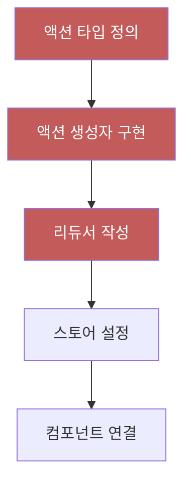
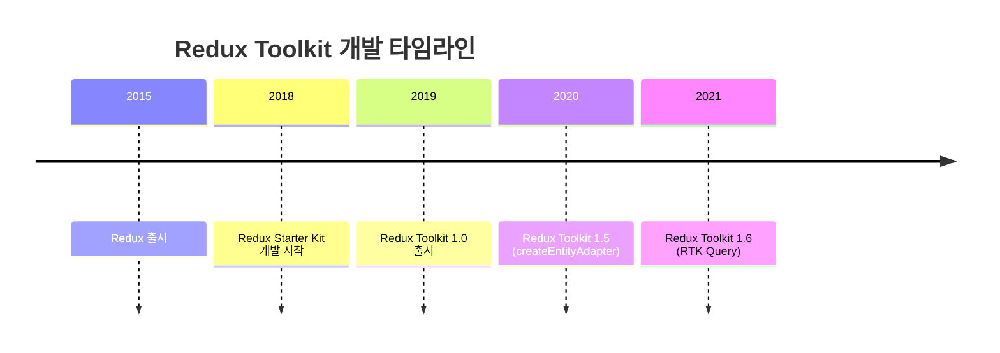
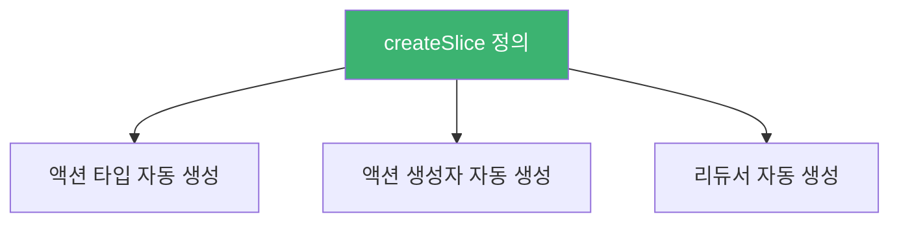
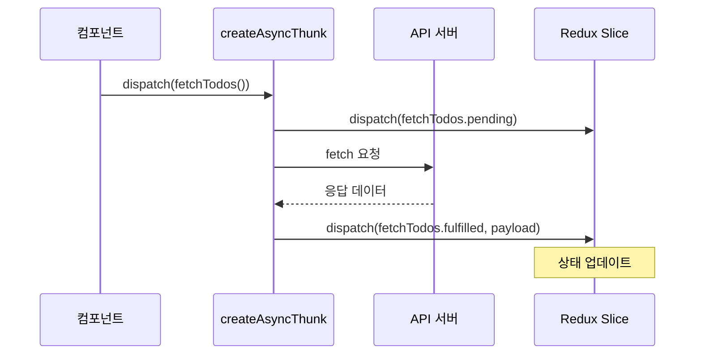
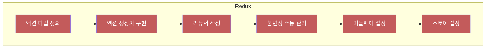
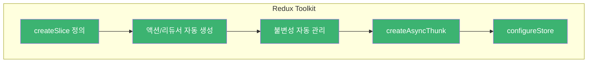

# Chapter 03 Redux Toolkit 소개

## 03-1 Redux의 문제점과 Redux Toolkit의 등장

### 개요
Redux는 강력한 상태 관리 라이브러리지만, 복잡한 보일러플레이트 코드와 설정으로 인해 개발자들이 어려움을 겪었습니다. 이 섹션에서는 기존 Redux의 문제점을 살펴보고, 이러한 문제를 해결하기 위해 등장한 Redux Toolkit의 배경과 목적을 이해합니다. Redux Toolkit이 어떻게 Redux 개발 경험을 개선하고 생산성을 높이는지 알아봅니다.

### Redux의 문제점

Redux는 예측 가능한 상태 관리를 제공하지만, 실제 프로젝트에서 사용할 때 여러 문제점이 드러났습니다.

#### 과도한 보일러플레이트 코드

Redux를 사용하면 간단한 기능을 구현하는 데도 많은 코드가 필요합니다. 액션 타입, 액션 생성자, 리듀서 등 여러 파일과 코드를 작성해야 합니다.

```javascript
// 액션 타입 정의
const ADD_TODO = 'ADD_TODO';
const TOGGLE_TODO = 'TOGGLE_TODO';
const SET_FILTER = 'SET_FILTER';

// 액션 생성자
const addTodo = (text) => ({
  type: ADD_TODO,
  payload: { id: nextTodoId++, text, completed: false }
});

const toggleTodo = (id) => ({
  type: TOGGLE_TODO,
  payload: { id }
});

// 리듀서
const initialState = { todos: [], filter: 'ALL' };

function todoReducer(state = initialState, action) {
  switch (action.type) {
    case ADD_TODO:
      return {
        ...state,
        todos: [...state.todos, action.payload]
      };
    case TOGGLE_TODO:
      return {
        ...state,
        todos: state.todos.map(todo =>
          todo.id === action.payload.id
            ? { ...todo, completed: !todo.completed }
            : todo
        )
      };
    case SET_FILTER:
      return {
        ...state,
        filter: action.payload
      };
    default:
      return state;
  }
}
```



#### 복잡한 비동기 로직 처리

비동기 작업을 처리하기 위해서는 추가적인 미들웨어(Redux Thunk, Redux Saga 등)를 설치하고 설정해야 합니다. 이로 인해 프로젝트의 복잡성이 증가하고 학습 곡선이 가파르게 됩니다.

```javascript
// Redux Thunk를 사용한 비동기 액션
const fetchTodos = () => {
  return async (dispatch) => {
    dispatch({ type: 'FETCH_TODOS_REQUEST' });
    
    try {
      const response = await fetch('https://api.example.com/todos');
      const data = await response.json();
      dispatch({ type: 'FETCH_TODOS_SUCCESS', payload: data });
    } catch (error) {
      dispatch({ type: 'FETCH_TODOS_FAILURE', error: error.message });
    }
  };
};
```

#### 불변성 유지의 어려움

Redux에서는 상태의 불변성을 유지해야 하는데, 중첩된 객체가 있는 경우 이를 수동으로 처리하는 것이 번거롭고 오류가 발생하기 쉽습니다.

```javascript
// 중첩된 객체의 불변성 유지
function complexReducer(state = initialState, action) {
  switch (action.type) {
    case 'UPDATE_USER_ADDRESS':
      return {
        ...state,
        user: {
          ...state.user,
          address: {
            ...state.user.address,
            street: action.payload.street
          }
        }
      };
    // 다른 케이스들...
    default:
      return state;
  }
}
```

#### 타입 안전성 부족

JavaScript로 Redux를 사용할 때 타입 안전성이 부족하여 런타임 오류가 발생할 가능성이 높습니다. TypeScript를 사용하더라도 추가적인 타입 정의가 필요합니다.

#### 설정의 복잡성

Redux 스토어 설정, 미들웨어 적용, 개발 도구 연결 등 초기 설정이 복잡하고 표준화된 방법이 없어 프로젝트마다 다른 방식으로 구현되는 경우가 많습니다.

```javascript
// 복잡한 스토어 설정
import { createStore, applyMiddleware, compose } from 'redux';
import thunk from 'redux-thunk';
import { createLogger } from 'redux-logger';
import rootReducer from './reducers';

const logger = createLogger();
const composeEnhancers = window.__REDUX_DEVTOOLS_EXTENSION_COMPOSE__ || compose;

const store = createStore(
  rootReducer,
  composeEnhancers(
    applyMiddleware(thunk, logger)
  )
);
```

### Redux Toolkit의 등장 배경

이러한 문제점들을 해결하기 위해 Redux 팀은 2019년에 Redux Toolkit(이하 RTK)을 공식적으로 출시했습니다. RTK는 "Redux를 위한 공식 도구 모음(The official, opinionated, batteries-included toolset for efficient Redux development)"으로 소개되었습니다.



#### Redux Toolkit의 목적

Redux Toolkit은 다음과 같은 목적으로 개발되었습니다:

1. **보일러플레이트 코드 감소**: 액션 타입, 액션 생성자, 리듀서 등을 간결하게 작성할 수 있도록 함
2. **모범 사례 적용**: Redux 사용의 모범 사례를 기본으로 포함
3. **일반적인 실수 방지**: 불변성 유지, 타입 안전성 등을 자동으로 처리
4. **개발 경험 개선**: 더 적은 코드로 더 많은 기능을 구현할 수 있도록 함

### Redux Toolkit의 주요 해결책

Redux Toolkit은 기존 Redux의 문제점을 어떻게 해결했는지 살펴보겠습니다.

#### 보일러플레이트 코드 감소

`createSlice` API를 통해 액션 타입, 액션 생성자, 리듀서를 한 번에 생성할 수 있습니다.

```javascript
// Redux Toolkit의 createSlice 사용
import { createSlice } from '@reduxjs/toolkit';

const todosSlice = createSlice({
  name: 'todos',
  initialState: { todos: [], filter: 'ALL' },
  reducers: {
    addTodo: (state, action) => {
      state.todos.push({
        id: Date.now(),
        text: action.payload,
        completed: false
      });
    },
    toggleTodo: (state, action) => {
      const todo = state.todos.find(todo => todo.id === action.payload);
      if (todo) {
        todo.completed = !todo.completed;
      }
    },
    setFilter: (state, action) => {
      state.filter = action.payload;
    }
  }
});

// 액션 생성자가 자동으로 생성됨
export const { addTodo, toggleTodo, setFilter } = todosSlice.actions;

// 리듀서도 자동으로 생성됨
export default todosSlice.reducer;
```



#### 내장된 불변성 로직

Redux Toolkit은 내부적으로 Immer 라이브러리를 사용하여 불변성을 자동으로 처리합니다. 이를 통해 개발자는 마치 상태를 직접 변경하는 것처럼 코드를 작성할 수 있지만, 실제로는 불변성이 유지됩니다.

```javascript
// 기존 Redux에서의 불변성 유지
const reducer = (state, action) => {
  return {
    ...state,
    user: {
      ...state.user,
      address: {
        ...state.user.address,
        street: action.payload
      }
    }
  };
};

// Redux Toolkit에서의 불변성 유지 (Immer 사용)
const reducer = (state, action) => {
  state.user.address.street = action.payload;
  // 실제로는 불변성이 유지됨
};
```

#### 비동기 로직 간소화

`createAsyncThunk`를 통해 비동기 작업을 더 쉽게 처리할 수 있습니다. 로딩, 성공, 실패 상태를 자동으로 처리해줍니다.

```javascript
// createAsyncThunk를 사용한 비동기 작업
import { createAsyncThunk, createSlice } from '@reduxjs/toolkit';

// 비동기 액션 생성
export const fetchTodos = createAsyncThunk(
  'todos/fetchTodos',
  async () => {
    const response = await fetch('https://api.example.com/todos');
    return response.json();
  }
);

// 슬라이스에서 비동기 액션 처리
const todosSlice = createSlice({
  name: 'todos',
  initialState: {
    items: [],
    status: 'idle',
    error: null
  },
  reducers: {
    // 동기 리듀서들...
  },
  extraReducers: (builder) => {
    builder
      .addCase(fetchTodos.pending, (state) => {
        state.status = 'loading';
      })
      .addCase(fetchTodos.fulfilled, (state, action) => {
        state.status = 'succeeded';
        state.items = action.payload;
      })
      .addCase(fetchTodos.rejected, (state, action) => {
        state.status = 'failed';
        state.error = action.error.message;
      });
  }
});
```



#### 타입 안전성 강화

Redux Toolkit은 TypeScript와의 통합이 잘 되어 있어, 타입 안전성을 높일 수 있습니다.

```typescript
// TypeScript와 함께 사용하는 Redux Toolkit
import { createSlice, PayloadAction } from '@reduxjs/toolkit';

interface Todo {
  id: number;
  text: string;
  completed: boolean;
}

interface TodosState {
  items: Todo[];
  filter: 'ALL' | 'ACTIVE' | 'COMPLETED';
}

const initialState: TodosState = {
  items: [],
  filter: 'ALL'
};

const todosSlice = createSlice({
  name: 'todos',
  initialState,
  reducers: {
    addTodo: (state, action: PayloadAction<string>) => {
      state.items.push({
        id: Date.now(),
        text: action.payload,
        completed: false
      });
    },
    toggleTodo: (state, action: PayloadAction<number>) => {
      const todo = state.items.find(todo => todo.id === action.payload);
      if (todo) {
        todo.completed = !todo.completed;
      }
    }
  }
});
```

#### 간소화된 스토어 설정

`configureStore`를 통해 스토어 설정을 간소화하고, 개발 도구와 미들웨어를 자동으로 설정할 수 있습니다.

```javascript
// 기존 Redux의 복잡한 스토어 설정
import { createStore, applyMiddleware, compose } from 'redux';
import thunk from 'redux-thunk';
import { createLogger } from 'redux-logger';
import rootReducer from './reducers';

const logger = createLogger();
const composeEnhancers = window.__REDUX_DEVTOOLS_EXTENSION_COMPOSE__ || compose;

const store = createStore(
  rootReducer,
  composeEnhancers(
    applyMiddleware(thunk, logger)
  )
);

// Redux Toolkit의 간소화된 스토어 설정
import { configureStore } from '@reduxjs/toolkit';
import todosReducer from './features/todos/todosSlice';
import filtersReducer from './features/filters/filtersSlice';
import logger from 'redux-logger';

const store = configureStore({
  reducer: {
    todos: todosReducer,
    filters: filtersReducer
  },
  middleware: (getDefaultMiddleware) => 
    getDefaultMiddleware().concat(logger)
});
```

### Redux vs Redux Toolkit 비교

Redux와 Redux Toolkit의 주요 차이점을 비교해 보겠습니다.





| 기능 | Redux | Redux Toolkit |
|------|-------|---------------|
| 보일러플레이트 | 많은 코드 필요 | `createSlice`로 간소화 |
| 불변성 관리 | 수동으로 처리 | Immer로 자동 처리 |
| 비동기 로직 | 미들웨어 직접 설정 | `createAsyncThunk` 제공 |
| 타입 안전성 | 추가 설정 필요 | TypeScript 통합 개선 |
| 스토어 설정 | 복잡한 설정 | `configureStore`로 간소화 |
| 개발 도구 | 수동 설정 | 자동 설정 |

### 5가지 키워드로 정리하는 핵심 포인트
1. **간소화(Simplification)**: Redux Toolkit은 보일러플레이트 코드를 줄이고 개발 과정을 간소화합니다.
2. **불변성(Immutability)**: Immer를 통해 불변성을 자동으로 관리하여 개발자의 부담을 줄입니다.
3. **표준화(Standardization)**: Redux 사용의 모범 사례를 기본으로 포함하여 일관된 코드 스타일을 유도합니다.
4. **효율성(Efficiency)**: 더 적은 코드로 더 많은 기능을 구현할 수 있어 개발 효율성이 향상됩니다.
5. **통합성(Integration)**: TypeScript, 개발 도구, 미들웨어 등과의 통합이 개선되어 개발 경험이 향상됩니다.

### 확인 문제
1. Redux Toolkit이 등장하게 된 주요 배경은 무엇인가요?
    - [ ] Redux의 성능 문제 해결
    - [ ] 과도한 보일러플레이트 코드와 복잡한 설정 문제 해결
    - [ ] React와의 호환성 문제 해결
    - [ ] 모바일 환경에서의 최적화 문제 해결

2. Redux Toolkit의 `createSlice` API가 제공하는 주요 이점은 무엇인가요?
    - [ ] 상태의 불변성을 자동으로 처리한다
    - [ ] 액션 타입, 액션 생성자, 리듀서를 한 번에 생성한다
    - [ ] 비동기 작업을 자동으로 처리한다
    - [ ] 컴포넌트와 스토어를 자동으로 연결한다

3. Redux Toolkit이 기존 Redux와 비교하여 개선한 부분은 무엇인가요? (복수 응답)
    - [ ] 보일러플레이트 코드 감소
    - [ ] 불변성 관리 자동화
    - [ ] 비동기 로직 처리 간소화
    - [ ] 타입 안전성 강화
    - [ ] 스토어 설정 간소화

> [정답 및 해설 보기](../answers_and_explanations.md#03-1-redux의-문제점과-redux-toolkit의-등장)
