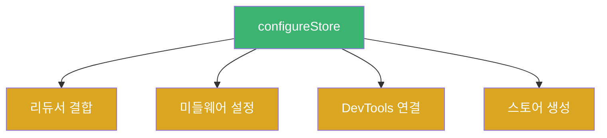
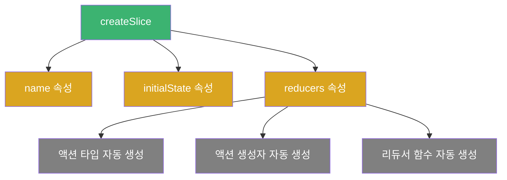
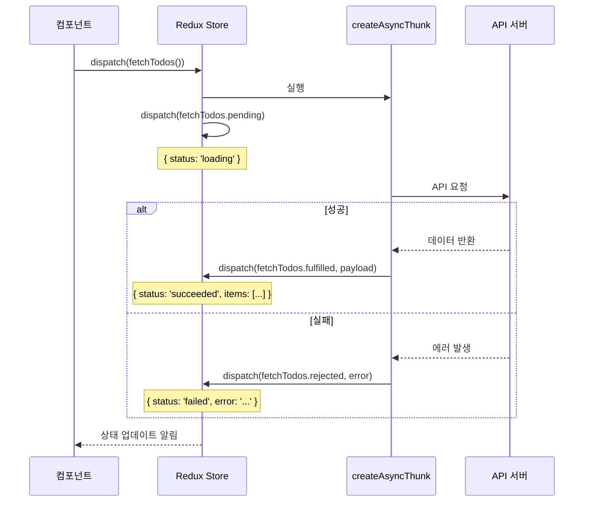
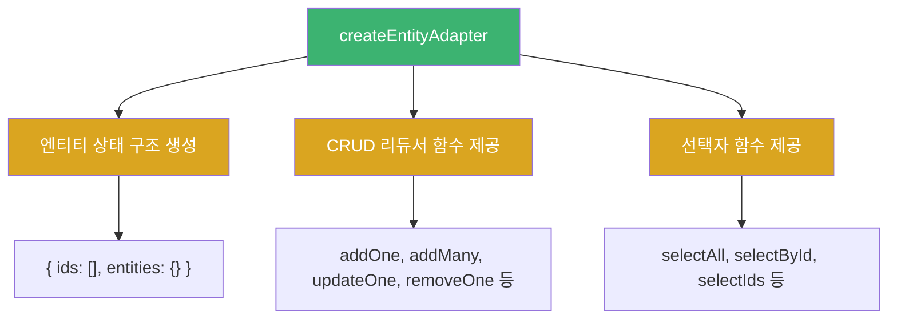
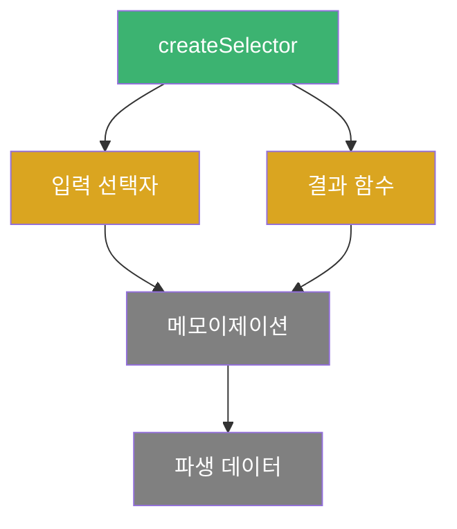
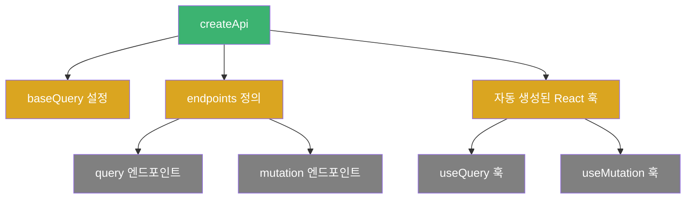
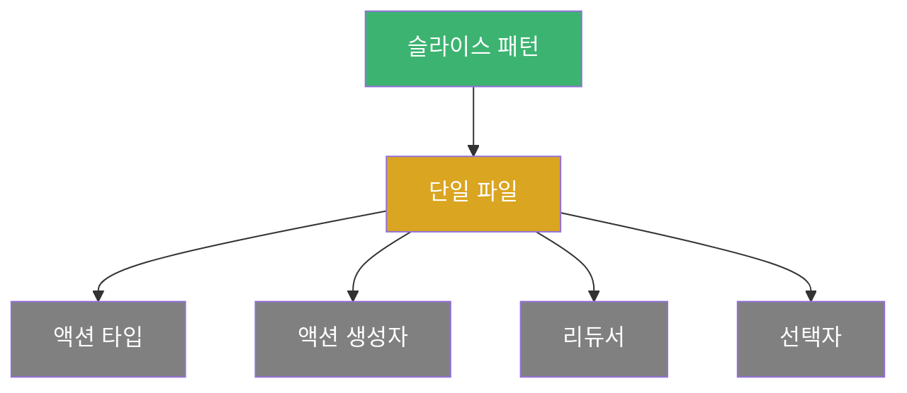
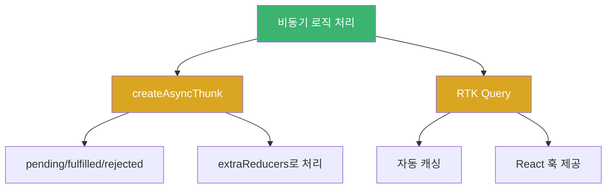

# Chapter 03 Redux Toolkit 소개

## 03-2 Redux Toolkit의 주요 기능

### 개요
Redux Toolkit은 Redux 개발을 더 쉽고 효율적으로 만들기 위한 공식 도구 모음입니다. 이 섹션에서는 Redux Toolkit의 핵심 API와 주요 기능들을 살펴보고, 이러한 기능들이 어떻게 Redux 개발 경험을 개선하는지 알아봅니다. 각 API의 사용 방법과 장점을 코드 예제와 함께 이해하여 실제 프로젝트에 적용할 수 있는 지식을 습득합니다.

### Redux Toolkit의 핵심 API

Redux Toolkit은 몇 가지 핵심 API를 제공하여 Redux 개발을 간소화합니다. 각 API의 역할과 사용법을 살펴보겠습니다.

#### configureStore

`configureStore`는 Redux 스토어를 생성하는 함수로, 기존 Redux의 `createStore`를 대체합니다. 이 함수는 다음과 같은 기능을 자동으로 설정합니다:

- Redux DevTools Extension 연결
- 기본 미들웨어 설정 (redux-thunk 포함)
- 개발 환경에서의 오류 검사

```javascript
// 기존 Redux의 스토어 설정
import { createStore, applyMiddleware, compose } from 'redux';
import thunk from 'redux-thunk';
import rootReducer from './reducers';

const composeEnhancers = window.__REDUX_DEVTOOLS_EXTENSION_COMPOSE__ || compose;
const store = createStore(
  rootReducer,
  composeEnhancers(applyMiddleware(thunk))
);

// Redux Toolkit의 스토어 설정
import { configureStore } from '@reduxjs/toolkit';
import todosReducer from './features/todos/todosSlice';
import filtersReducer from './features/filters/filtersSlice';

const store = configureStore({
  reducer: {
    todos: todosReducer,
    filters: filtersReducer
  }
  // 기본 미들웨어와 DevTools가 자동으로 설정됨
});
```



`configureStore`는 다음과 같은 옵션을 제공합니다:

```javascript
configureStore({
  // 단일 리듀서 또는 리듀서 객체
  reducer: rootReducer,
  
  // 미들웨어 커스터마이징
  middleware: (getDefaultMiddleware) =>
    getDefaultMiddleware().concat(logger),
  
  // 초기 상태 설정
  preloadedState: initialState,
  
  // 스토어 인핸서 설정
  enhancers: [reduxBatch],
  
  // DevTools 비활성화 (기본값: true)
  devTools: process.env.NODE_ENV !== 'production'
});
```

#### createSlice

`createSlice`는 Redux Toolkit의 가장 강력한 API 중 하나로, 액션 타입, 액션 생성자, 리듀서를 한 번에 생성합니다. 이를 통해 보일러플레이트 코드를 크게 줄일 수 있습니다.

```javascript
import { createSlice } from '@reduxjs/toolkit';

const todosSlice = createSlice({
  // 슬라이스 이름 (액션 타입의 접두사로 사용됨)
  name: 'todos',
  
  // 초기 상태
  initialState: {
    items: [],
    status: 'idle',
    error: null
  },
  
  // 리듀서 함수들
  reducers: {
    // 액션 타입: 'todos/addTodo'
    addTodo: (state, action) => {
      // Immer를 통해 "변경"하는 것처럼 작성해도 불변성 유지
      state.items.push({
        id: Date.now(),
        text: action.payload,
        completed: false
      });
    },
    
    // 액션 타입: 'todos/toggleTodo'
    toggleTodo: (state, action) => {
      const todo = state.items.find(todo => todo.id === action.payload);
      if (todo) {
        todo.completed = !todo.completed;
      }
    },
    
    // 액션 타입: 'todos/clearCompleted'
    clearCompleted: (state) => {
      state.items = state.items.filter(todo => !todo.completed);
    }
  }
});

// 액션 생성자 자동 생성
export const { addTodo, toggleTodo, clearCompleted } = todosSlice.actions;

// 리듀서 자동 생성
export default todosSlice.reducer;
```



`createSlice`는 내부적으로 Immer 라이브러리를 사용하여 불변성을 자동으로 처리합니다. 이를 통해 개발자는 상태를 직접 변경하는 것처럼 코드를 작성할 수 있지만, 실제로는 불변성이 유지됩니다.

#### createAsyncThunk

`createAsyncThunk`는 비동기 작업을 처리하기 위한 API로, 비동기 액션의 생명주기(pending, fulfilled, rejected)를 자동으로 관리합니다.

```javascript
import { createAsyncThunk, createSlice } from '@reduxjs/toolkit';

// 비동기 액션 생성
export const fetchTodos = createAsyncThunk(
  'todos/fetchTodos', // 액션 타입 접두사
  async (_, { rejectWithValue }) => {
    try {
      const response = await fetch('https://api.example.com/todos');
      if (!response.ok) {
        throw new Error('서버 에러');
      }
      return await response.json();
    } catch (error) {
      return rejectWithValue(error.message);
    }
  }
);

// 슬라이스에서 비동기 액션 처리
const todosSlice = createSlice({
  name: 'todos',
  initialState: {
    items: [],
    status: 'idle', // 'idle' | 'loading' | 'succeeded' | 'failed'
    error: null
  },
  reducers: {
    // 일반 리듀서들...
  },
  extraReducers: (builder) => {
    builder
      // 요청 시작 시 상태 변경
      .addCase(fetchTodos.pending, (state) => {
        state.status = 'loading';
      })
      // 요청 성공 시 상태 변경
      .addCase(fetchTodos.fulfilled, (state, action) => {
        state.status = 'succeeded';
        state.items = action.payload;
      })
      // 요청 실패 시 상태 변경
      .addCase(fetchTodos.rejected, (state, action) => {
        state.status = 'failed';
        state.error = action.payload || action.error.message;
      });
  }
});
```



`createAsyncThunk`는 다음과 같은 기능을 제공합니다:

1. 비동기 작업의 세 가지 상태(pending, fulfilled, rejected)에 대한 액션 타입 자동 생성
2. 비동기 작업의 결과 또는 오류를 페이로드로 포함하는 액션 생성
3. 비동기 작업 취소, 조건부 실행 등의 고급 기능 제공

#### createEntityAdapter

`createEntityAdapter`는 정규화된 데이터를 관리하기 위한 API로, ID로 식별되는 엔티티 컬렉션(예: 사용자, 게시물, 댓글 등)을 효율적으로 저장하고 조작할 수 있게 해줍니다.

```javascript
import { createEntityAdapter, createSlice } from '@reduxjs/toolkit';

// 엔티티 어댑터 생성
const todosAdapter = createEntityAdapter({
  // ID로 사용할 필드 지정 (기본값: 'id')
  selectId: (todo) => todo.id,
  // 정렬 기준 지정 (선택 사항)
  sortComparer: (a, b) => a.createdAt - b.createdAt
});

// 초기 상태 생성 (빈 엔티티 객체와 추가 필드)
const initialState = todosAdapter.getInitialState({
  status: 'idle',
  error: null
});

const todosSlice = createSlice({
  name: 'todos',
  initialState,
  reducers: {
    // 어댑터의 CRUD 메서드 사용
    todoAdded: todosAdapter.addOne,
    todosAdded: todosAdapter.addMany,
    todoUpdated: todosAdapter.updateOne,
    todoRemoved: todosAdapter.removeOne,
    todosCleared: todosAdapter.removeAll
  }
});

// 어댑터의 선택자 함수 생성
export const {
  selectAll: selectAllTodos,
  selectById: selectTodoById,
  selectIds: selectTodoIds
} = todosAdapter.getSelectors((state) => state.todos);
```



`createEntityAdapter`는 다음과 같은 이점을 제공합니다:

1. 정규화된 데이터 구조 자동 관리 (`{ ids: [], entities: {} }`)
2. 엔티티 조작을 위한 표준 CRUD 작업 제공
3. 엔티티 선택을 위한 메모이제이션된 선택자 함수 제공
4. 성능 최적화 및 코드 일관성 향상

#### createSelector

`createSelector`는 Redux의 reselect 라이브러리에서 가져온 API로, 메모이제이션된 선택자 함수를 생성합니다. 이를 통해 파생 데이터를 효율적으로 계산할 수 있습니다.

```javascript
import { createSelector } from '@reduxjs/toolkit';

// 기본 선택자
const selectTodos = state => state.todos.items;
const selectFilter = state => state.todos.filter;

// 메모이제이션된 선택자
export const selectFilteredTodos = createSelector(
  [selectTodos, selectFilter],
  (todos, filter) => {
    switch (filter) {
      case 'COMPLETED':
        return todos.filter(todo => todo.completed);
      case 'ACTIVE':
        return todos.filter(todo => !todo.completed);
      default:
        return todos;
    }
  }
);

// 추가 파생 데이터
export const selectTodoStats = createSelector(
  [selectTodos],
  (todos) => {
    const total = todos.length;
    const completed = todos.filter(todo => todo.completed).length;
    const active = total - completed;
    const percentComplete = total === 0 ? 0 : (completed / total) * 100;
    
    return { total, completed, active, percentComplete };
  }
);
```



`createSelector`의 주요 이점:

1. 메모이제이션을 통한 성능 최적화 (입력이 변경되지 않으면 재계산하지 않음)
2. 복잡한 데이터 변환 로직을 리듀서에서 분리
3. 컴포넌트에서 필요한 형태로 데이터 가공
4. 여러 상태 조각을 조합하여 파생 데이터 생성

### RTK Query

RTK Query는 Redux Toolkit의 일부로, 데이터 가져오기 및 캐싱을 위한 강력한 도구입니다. API 통신을 위한 보일러플레이트 코드를 크게 줄이고, 캐싱, 중복 요청 방지, 낙관적 업데이트 등의 기능을 제공합니다.

```javascript
import { createApi, fetchBaseQuery } from '@reduxjs/toolkit/query/react';

// API 정의
export const apiSlice = createApi({
  // 리듀서 경로
  reducerPath: 'api',
  
  // 기본 쿼리 함수
  baseQuery: fetchBaseQuery({ baseUrl: 'https://api.example.com' }),
  
  // 엔드포인트 정의
  endpoints: (builder) => ({
    // 데이터 조회 엔드포인트
    getTodos: builder.query({
      query: () => '/todos',
      // 응답 변환
      transformResponse: (response) => response.sort((a, b) => b.id - a.id),
      // 태그 기반 캐싱
      providesTags: ['Todos']
    }),
    
    // 데이터 변경 엔드포인트
    addTodo: builder.mutation({
      query: (todo) => ({
        url: '/todos',
        method: 'POST',
        body: todo
      }),
      // 캐시 무효화
      invalidatesTags: ['Todos']
    }),
    
    // 데이터 업데이트 엔드포인트
    updateTodo: builder.mutation({
      query: ({ id, ...todo }) => ({
        url: `/todos/${id}`,
        method: 'PATCH',
        body: todo
      }),
      invalidatesTags: (result, error, arg) => [{ type: 'Todos', id: arg.id }]
    })
  })
});

// 자동 생성된 훅 내보내기
export const {
  useGetTodosQuery,
  useAddTodoMutation,
  useUpdateTodoMutation
} = apiSlice;
```



RTK Query의 주요 기능:

1. **자동 캐싱**: 동일한 데이터에 대한 중복 요청 방지
2. **캐시 무효화**: 데이터 변경 시 관련 캐시 자동 업데이트
3. **로딩 및 오류 상태 관리**: 데이터 가져오기 상태 자동 추적
4. **폴링 및 리페칭**: 주기적인 데이터 업데이트 지원
5. **낙관적 업데이트**: 서버 응답 전에 UI 업데이트
6. **React 통합**: 사용하기 쉬운 React 훅 제공

React 컴포넌트에서의 사용 예:

```javascript
import React from 'react';
import { useGetTodosQuery, useAddTodoMutation } from './apiSlice';

function TodoList() {
  const [newTodo, setNewTodo] = useState('');
  
  // 데이터 조회 훅
  const {
    data: todos,
    isLoading,
    isSuccess,
    isError,
    error,
    refetch
  } = useGetTodosQuery();
  
  // 데이터 변경 훅
  const [addTodo, { isLoading: isAdding }] = useAddTodoMutation();
  
  const handleAddTodo = async () => {
    if (!newTodo.trim()) return;
    try {
      await addTodo({ text: newTodo, completed: false }).unwrap();
      setNewTodo('');
    } catch (err) {
      console.error('Failed to add todo:', err);
    }
  };
  
  let content;
  if (isLoading) {
    content = <div>로딩 중...</div>;
  } else if (isError) {
    content = <div>오류: {error.message}</div>;
  } else if (isSuccess) {
    content = (
      <ul>
        {todos.map(todo => (
          <li key={todo.id}>{todo.text}</li>
        ))}
      </ul>
    );
  }
  
  return (
    <div>
      <h1>할 일 목록</h1>
      {content}
      <div>
        <input
          value={newTodo}
          onChange={e => setNewTodo(e.target.value)}
          disabled={isAdding}
        />
        <button onClick={handleAddTodo} disabled={isAdding}>
          {isAdding ? '추가 중...' : '추가'}
        </button>
      </div>
      <button onClick={refetch}>새로고침</button>
    </div>
  );
}
```

### Redux Toolkit의 추가 유틸리티

Redux Toolkit은 위에서 설명한 주요 API 외에도 다양한 유틸리티 함수를 제공합니다.

#### createAction

`createAction`은 액션 생성자 함수를 생성하는 유틸리티입니다.

```javascript
import { createAction } from '@reduxjs/toolkit';

// 액션 생성자 생성
const increment = createAction('counter/increment');
const decrement = createAction('counter/decrement');
const incrementByAmount = createAction('counter/incrementByAmount');

// 사용 예
increment(); // { type: 'counter/increment' }
incrementByAmount(5); // { type: 'counter/incrementByAmount', payload: 5 }

// 페이로드 변환
const addTodo = createAction('todos/add', (text) => ({
  payload: {
    id: Date.now(),
    text,
    completed: false
  }
}));

addTodo('새 할 일');
// { type: 'todos/add', payload: { id: 1629483029, text: '새 할 일', completed: false } }
```

#### createReducer

`createReducer`는 switch 문 대신 액션 타입에 따른 리듀서 함수 맵을 사용하여 리듀서를 생성합니다.

```javascript
import { createAction, createReducer } from '@reduxjs/toolkit';

// 액션 생성자
const increment = createAction('counter/increment');
const decrement = createAction('counter/decrement');
const incrementByAmount = createAction('counter/incrementByAmount');

// 초기 상태
const initialState = { value: 0 };

// 리듀서 생성 (빌더 콜백 방식)
const counterReducer = createReducer(initialState, (builder) => {
  builder
    .addCase(increment, (state) => {
      state.value += 1; // Immer를 통한 불변성 자동 처리
    })
    .addCase(decrement, (state) => {
      state.value -= 1;
    })
    .addCase(incrementByAmount, (state, action) => {
      state.value += action.payload;
    })
    .addDefaultCase((state, action) => {
      // 처리되지 않은 액션 타입에 대한 기본 동작
    });
});

// 맵 객체 방식 (대체 문법)
const counterReducer = createReducer(initialState, {
  [increment]: (state) => {
    state.value += 1;
  },
  [decrement]: (state) => {
    state.value -= 1;
  },
  [incrementByAmount]: (state, action) => {
    state.value += action.payload;
  }
});
```

### Redux Toolkit 사용 패턴

Redux Toolkit을 효과적으로 사용하기 위한 몇 가지 패턴을 살펴보겠습니다.

#### 덕스 패턴과 슬라이스 패턴

Redux Toolkit은 "덕스(Ducks)" 패턴을 확장한 "슬라이스" 패턴을 권장합니다. 이 패턴은 관련된 액션 타입, 액션 생성자, 리듀서를 하나의 파일에 모아 기능 단위로 코드를 구성합니다.

```javascript
// features/counter/counterSlice.js
import { createSlice } from '@reduxjs/toolkit';

const counterSlice = createSlice({
  name: 'counter',
  initialState: { value: 0 },
  reducers: {
    increment: (state) => {
      state.value += 1;
    },
    decrement: (state) => {
      state.value -= 1;
    },
    incrementByAmount: (state, action) => {
      state.value += action.payload;
    }
  }
});

// 액션 생성자 내보내기
export const { increment, decrement, incrementByAmount } = counterSlice.actions;

// 선택자 함수 내보내기
export const selectCount = (state) => state.counter.value;

// 리듀서 내보내기
export default counterSlice.reducer;
```



#### 비동기 로직 처리 패턴

Redux Toolkit에서 비동기 로직을 처리하는 두 가지 주요 방법이 있습니다:

1. **createAsyncThunk + extraReducers**:
   ```javascript
   // 비동기 액션 생성
   export const fetchTodos = createAsyncThunk(
     'todos/fetchTodos',
     async () => {
       const response = await fetch('https://api.example.com/todos');
       return response.json();
     }
   );
   
   // 슬라이스에서 처리
   const todosSlice = createSlice({
     name: 'todos',
     initialState,
     reducers: {
       // 동기 리듀서들...
     },
     extraReducers: (builder) => {
       builder
         .addCase(fetchTodos.pending, (state) => {
           state.status = 'loading';
         })
         .addCase(fetchTodos.fulfilled, (state, action) => {
           state.status = 'succeeded';
           state.items = action.payload;
         })
         .addCase(fetchTodos.rejected, (state, action) => {
           state.status = 'failed';
           state.error = action.error.message;
         });
     }
   });
   ```

2. **RTK Query**:
   ```javascript
   // API 슬라이스 정의
   export const apiSlice = createApi({
     reducerPath: 'api',
     baseQuery: fetchBaseQuery({ baseUrl: 'https://api.example.com' }),
     endpoints: (builder) => ({
       getTodos: builder.query({
         query: () => '/todos'
       }),
       addTodo: builder.mutation({
         query: (todo) => ({
           url: '/todos',
           method: 'POST',
           body: todo
         })
       })
     })
   });
   
   // 컴포넌트에서 사용
   function TodoList() {
     const { data: todos, isLoading } = apiSlice.useGetTodosQuery();
     const [addTodo] = apiSlice.useAddTodoMutation();
     
     // ...
   }
   ```



### 7가지 키워드로 정리하는 핵심 포인트
1. **configureStore**: 스토어 설정을 간소화하고 개발 도구와 미들웨어를 자동으로 설정하는 API입니다.
2. **createSlice**: 액션 타입, 액션 생성자, 리듀서를 한 번에 생성하여 보일러플레이트 코드를 줄이는 API입니다.
3. **Immer**: Redux Toolkit이 내부적으로 사용하는 라이브러리로, 불변성을 자동으로 처리합니다.
4. **createAsyncThunk**: 비동기 작업의 생명주기(pending, fulfilled, rejected)를 자동으로 관리하는 API입니다.
5. **createEntityAdapter**: 정규화된 데이터를 효율적으로 관리하기 위한 API입니다.
6. **createSelector**: 메모이제이션된 선택자 함수를 생성하여 파생 데이터를 효율적으로 계산하는 API입니다.
7. **RTK Query**: 데이터 가져오기 및 캐싱을 위한 강력한 도구로, API 통신을 위한 보일러플레이트 코드를 크게 줄입니다.

### 확인 문제
1. Redux Toolkit의 `configureStore` 함수가 자동으로 설정하는 것은 무엇인가요?
    - [ ] 컴포넌트와 스토어 연결
    - [ ] 리듀서 함수 생성
    - [ ] Redux DevTools Extension 연결
    - [ ] 상태의 불변성 처리

2. Redux Toolkit의 `createSlice`가 제공하는 기능이 아닌 것은 무엇인가요?
    - [ ] 액션 타입 자동 생성
    - [ ] 액션 생성자 자동 생성
    - [ ] 리듀서 함수 자동 생성
    - [ ] API 요청 자동 처리

3. Redux Toolkit에서 비동기 작업을 처리하는 방법으로 올바른 것은 무엇인가요? (복수 응답)
    - [ ] `createAsyncThunk` 사용
    - [ ] `RTK Query` 사용
    - [ ] `createSlice`의 `asyncReducers` 속성 사용
    - [ ] `configureStore`의 `asyncMiddleware` 설정 사용
    - [ ] `extraReducers`에서 비동기 액션 처리

4. Redux Toolkit의 `createEntityAdapter`가 제공하는 기능은 무엇인가요? (복수 응답)
    - [ ] 정규화된 데이터 구조 자동 관리
    - [ ] 엔티티 조작을 위한 표준 CRUD 작업 제공
    - [ ] 엔티티 선택을 위한 메모이제이션된 선택자 함수 제공
    - [ ] 엔티티 데이터의 자동 캐싱
    - [ ] 엔티티 데이터의 자동 직렬화/역직렬화

> [정답 및 해설 보기](../answers_and_explanations.md#03-2-redux-toolkit의-주요-기능)
