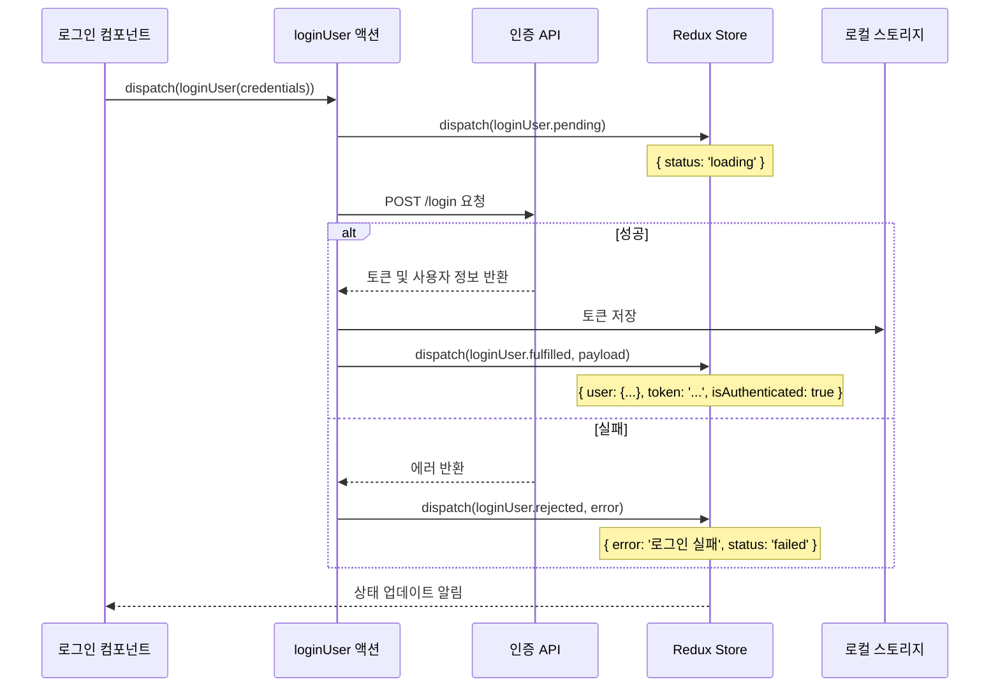
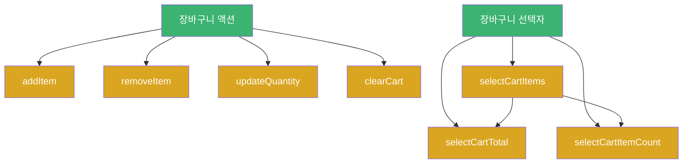
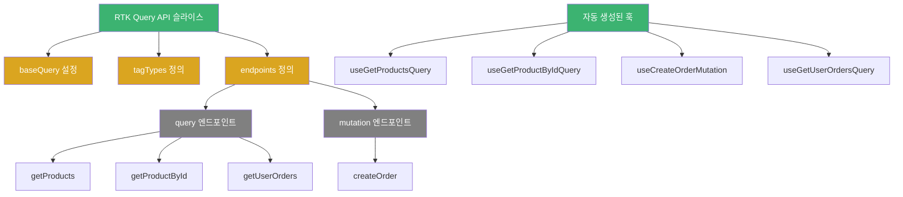
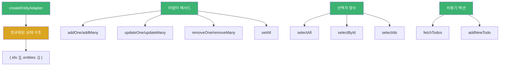

# Chapter 03 Redux Toolkit 소개

## 03-3 Redux Toolkit 실전 활용 사례

### 개요
Redux Toolkit은 Redux의 복잡성을 크게 줄이고 개발 경험을 향상시키는 강력한 도구입니다. 이 섹션에서는 Redux Toolkit을 실제 프로젝트에 적용하는 다양한 사례를 살펴보고, 각 사례별 구현 방법과 패턴을 알아봅니다. 실전 예제를 통해 Redux Toolkit의 주요 기능들을 어떻게 효과적으로 활용할 수 있는지 이해하고, 프로젝트에 적용할 수 있는 실용적인 지식을 습득합니다.

### 사용자 인증 관리

사용자 인증은 대부분의 웹 애플리케이션에서 필수적인 기능으로, Redux Toolkit을 사용하여 효율적으로 구현할 수 있습니다.

#### 인증 상태 관리 슬라이스 구현

```javascript
import { createSlice, createAsyncThunk } from '@reduxjs/toolkit';

// 비동기 로그인 액션
export const loginUser = createAsyncThunk(
  'auth/login',
  async (credentials, { rejectWithValue }) => {
    try {
      const response = await fetch('https://api.example.com/login', {
        method: 'POST',
        headers: { 'Content-Type': 'application/json' },
        body: JSON.stringify(credentials)
      });
      
      if (!response.ok) {
        throw new Error('로그인 실패');
      }
      
      const data = await response.json();
      // 토큰을 로컬 스토리지에 저장
      localStorage.setItem('token', data.token);
      return data;
    } catch (error) {
      return rejectWithValue(error.message);
    }
  }
);

// 로그아웃 액션
export const logoutUser = createAsyncThunk(
  'auth/logout',
  async () => {
    localStorage.removeItem('token');
    return null;
  }
);

// 인증 슬라이스
const authSlice = createSlice({
  name: 'auth',
  initialState: {
    user: null,
    token: localStorage.getItem('token') || null,
    isAuthenticated: !!localStorage.getItem('token'),
    status: 'idle', // 'idle' | 'loading' | 'succeeded' | 'failed'
    error: null
  },
  reducers: {
    // 추가 리듀서 (필요시)
    clearError: (state) => {
      state.error = null;
    }
  },
  extraReducers: (builder) => {
    builder
      // 로그인 처리
      .addCase(loginUser.pending, (state) => {
        state.status = 'loading';
        state.error = null;
      })
      .addCase(loginUser.fulfilled, (state, action) => {
        state.status = 'succeeded';
        state.user = action.payload.user;
        state.token = action.payload.token;
        state.isAuthenticated = true;
      })
      .addCase(loginUser.rejected, (state, action) => {
        state.status = 'failed';
        state.error = action.payload;
      })
      // 로그아웃 처리
      .addCase(logoutUser.fulfilled, (state) => {
        state.user = null;
        state.token = null;
        state.isAuthenticated = false;
        state.status = 'idle';
      });
  }
});

export const { clearError } = authSlice.actions;
export default authSlice.reducer;
```



#### 인증 상태를 활용한 컴포넌트 구현

```javascript
import React, { useState } from 'react';
import { useDispatch, useSelector } from 'react-redux';
import { loginUser, clearError } from './authSlice';

function LoginForm() {
  const [email, setEmail] = useState('');
  const [password, setPassword] = useState('');
  
  const dispatch = useDispatch();
  const { status, error } = useSelector(state => state.auth);
  
  const handleSubmit = async (e) => {
    e.preventDefault();
    dispatch(loginUser({ email, password }));
  };
  
  return (
    <form onSubmit={handleSubmit}>
      {error && <div className="error">{error}</div>}
      <div>
        <label>이메일:</label>
        <input
          type="email"
          value={email}
          onChange={(e) => setEmail(e.target.value)}
          required
        />
      </div>
      <div>
        <label>비밀번호:</label>
        <input
          type="password"
          value={password}
          onChange={(e) => setPassword(e.target.value)}
          required
        />
      </div>
      <button type="submit" disabled={status === 'loading'}>
        {status === 'loading' ? '로그인 중...' : '로그인'}
      </button>
    </form>
  );
}

// 인증 상태에 따른 조건부 라우팅
function PrivateRoute({ children }) {
  const { isAuthenticated } = useSelector(state => state.auth);
  
  return isAuthenticated ? children : <Navigate to="/login" />;
}
```

### 장바구니 기능 구현

온라인 쇼핑몰의 장바구니 기능은 Redux Toolkit을 활용하여 효과적으로 구현할 수 있는 대표적인 사례입니다.

#### 장바구니 슬라이스 구현

```javascript
import { createSlice, createSelector } from '@reduxjs/toolkit';

const cartSlice = createSlice({
  name: 'cart',
  initialState: {
    items: [],
    status: 'idle',
    error: null
  },
  reducers: {
    addItem: (state, action) => {
      const { id, name, price, quantity = 1 } = action.payload;
      const existingItem = state.items.find(item => item.id === id);
      
      if (existingItem) {
        existingItem.quantity += quantity;
      } else {
        state.items.push({ id, name, price, quantity });
      }
    },
    removeItem: (state, action) => {
      state.items = state.items.filter(item => item.id !== action.payload);
    },
    updateQuantity: (state, action) => {
      const { id, quantity } = action.payload;
      const item = state.items.find(item => item.id === id);
      
      if (item) {
        item.quantity = Math.max(1, quantity);
      }
    },
    clearCart: (state) => {
      state.items = [];
    }
  }
});

// 액션 생성자 내보내기
export const { addItem, removeItem, updateQuantity, clearCart } = cartSlice.actions;

// 선택자 함수
export const selectCartItems = state => state.cart.items;

// 메모이제이션된 선택자
export const selectCartTotal = createSelector(
  [selectCartItems],
  (items) => items.reduce((total, item) => total + (item.price * item.quantity), 0)
);

export const selectCartItemCount = createSelector(
  [selectCartItems],
  (items) => items.reduce((count, item) => count + item.quantity, 0)
);

export default cartSlice.reducer;
```



#### 장바구니 컴포넌트 구현

```javascript
import React from 'react';
import { useSelector, useDispatch } from 'react-redux';
import { 
  removeItem, 
  updateQuantity, 
  clearCart,
  selectCartItems,
  selectCartTotal
} from './cartSlice';

function CartPage() {
  const dispatch = useDispatch();
  const cartItems = useSelector(selectCartItems);
  const cartTotal = useSelector(selectCartTotal);
  
  const handleQuantityChange = (id, quantity) => {
    dispatch(updateQuantity({ id, quantity }));
  };
  
  const handleRemoveItem = (id) => {
    dispatch(removeItem(id));
  };
  
  const handleClearCart = () => {
    dispatch(clearCart());
  };
  
  if (cartItems.length === 0) {
    return <div>장바구니가 비어 있습니다.</div>;
  }
  
  return (
    <div>
      <h2>장바구니</h2>
      <table>
        <thead>
          <tr>
            <th>상품명</th>
            <th>가격</th>
            <th>수량</th>
            <th>합계</th>
            <th>삭제</th>
          </tr>
        </thead>
        <tbody>
          {cartItems.map(item => (
            <tr key={item.id}>
              <td>{item.name}</td>
              <td>${item.price.toFixed(2)}</td>
              <td>
                <button 
                  onClick={() => handleQuantityChange(item.id, item.quantity - 1)}
                  disabled={item.quantity <= 1}
                >
                  -
                </button>
                <span>{item.quantity}</span>
                <button 
                  onClick={() => handleQuantityChange(item.id, item.quantity + 1)}
                >
                  +
                </button>
              </td>
              <td>${(item.price * item.quantity).toFixed(2)}</td>
              <td>
                <button onClick={() => handleRemoveItem(item.id)}>삭제</button>
              </td>
            </tr>
          ))}
        </tbody>
      </table>
      <div>
        <strong>총 금액: ${cartTotal.toFixed(2)}</strong>
      </div>
      <button onClick={handleClearCart}>장바구니 비우기</button>
      <button>결제하기</button>
    </div>
  );
}
```

### RTK Query를 활용한 데이터 관리

RTK Query는 Redux Toolkit의 강력한 데이터 가져오기 및 캐싱 도구로, API 통신을 위한 보일러플레이트 코드를 크게 줄이고 다양한 기능을 제공합니다.

#### API 슬라이스 구현

```javascript
import { createApi, fetchBaseQuery } from '@reduxjs/toolkit/query/react';

// API 슬라이스 정의
export const apiSlice = createApi({
  reducerPath: 'api',
  baseQuery: fetchBaseQuery({ 
    baseUrl: 'https://api.example.com',
    prepareHeaders: (headers, { getState }) => {
      // 인증 토큰 추가
      const token = getState().auth.token;
      if (token) {
        headers.set('authorization', `Bearer ${token}`);
      }
      return headers;
    }
  }),
  tagTypes: ['Products', 'Orders', 'User'],
  endpoints: (builder) => ({
    // 상품 목록 조회
    getProducts: builder.query({
      query: () => '/products',
      providesTags: ['Products']
    }),
    
    // 상품 상세 조회
    getProductById: builder.query({
      query: (id) => `/products/${id}`,
      providesTags: (result, error, id) => [{ type: 'Products', id }]
    }),
    
    // 주문 생성
    createOrder: builder.mutation({
      query: (order) => ({
        url: '/orders',
        method: 'POST',
        body: order
      }),
      invalidatesTags: ['Orders']
    }),
    
    // 사용자 주문 내역 조회
    getUserOrders: builder.query({
      query: () => '/orders/me',
      providesTags: ['Orders']
    })
  })
});

// 자동 생성된 훅 내보내기
export const {
  useGetProductsQuery,
  useGetProductByIdQuery,
  useCreateOrderMutation,
  useGetUserOrdersQuery
} = apiSlice;
```



#### RTK Query를 활용한 상품 목록 컴포넌트

```javascript
import React from 'react';
import { useGetProductsQuery } from './apiSlice';

function ProductList() {
  const {
    data: products,
    isLoading,
    isSuccess,
    isError,
    error,
    refetch
  } = useGetProductsQuery();
  
  let content;
  
  if (isLoading) {
    content = <div>로딩 중...</div>;
  } else if (isError) {
    content = <div>오류: {error.message}</div>;
  } else if (isSuccess) {
    content = (
      <div className="products-grid">
        {products.map(product => (
          <div key={product.id} className="product-card">
            
            <h3>{product.name}</h3>
            <p>${product.price.toFixed(2)}</p>
            <button>장바구니에 추가</button>
          </div>
        ))}
      </div>
    );
  }
  
  return (
    <div>
      <h2>상품 목록</h2>
      <button onClick={refetch}>새로고침</button>
      {content}
    </div>
  );
}
```

#### RTK Query를 활용한 상품 상세 컴포넌트

```javascript
import React from 'react';
import { useParams } from 'react-router-dom';
import { useGetProductByIdQuery } from './apiSlice';
import { useDispatch } from 'react-redux';
import { addItem } from './cartSlice';

function ProductDetail() {
  const { id } = useParams();
  const dispatch = useDispatch();
  
  const {
    data: product,
    isLoading,
    isSuccess,
    isError,
    error
  } = useGetProductByIdQuery(id);
  
  const handleAddToCart = () => {
    if (product) {
      dispatch(addItem({
        id: product.id,
        name: product.name,
        price: product.price,
        quantity: 1
      }));
    }
  };
  
  let content;
  
  if (isLoading) {
    content = <div>로딩 중...</div>;
  } else if (isError) {
    content = <div>오류: {error.message}</div>;
  } else if (isSuccess) {
    content = (
      <div className="product-detail">
        <div className="product-image">
          
        </div>
        <div className="product-info">
          <h2>{product.name}</h2>
          <p className="price">${product.price.toFixed(2)}</p>
          <p className="description">{product.description}</p>
          <button onClick={handleAddToCart}>장바구니에 추가</button>
        </div>
      </div>
    );
  }
  
  return content;
}
```

### createEntityAdapter를 활용한 정규화된 데이터 관리

복잡한 엔티티 관계를 가진 데이터를 효율적으로 관리하기 위해 `createEntityAdapter`를 활용할 수 있습니다.

#### 할 일 관리 애플리케이션 구현

```javascript
import { 
  createSlice, 
  createEntityAdapter,
  createAsyncThunk 
} from '@reduxjs/toolkit';

// 엔티티 어댑터 생성
const todosAdapter = createEntityAdapter({
  // ID로 사용할 필드 지정 (기본값: 'id')
  selectId: (todo) => todo.id,
  // 정렬 기준 지정
  sortComparer: (a, b) => a.createdAt - b.createdAt
});

// 비동기 액션: 할 일 목록 가져오기
export const fetchTodos = createAsyncThunk(
  'todos/fetchTodos',
  async () => {
    const response = await fetch('https://api.example.com/todos');
    return await response.json();
  }
);

// 비동기 액션: 할 일 추가하기
export const addNewTodo = createAsyncThunk(
  'todos/addNewTodo',
  async (todo) => {
    const response = await fetch('https://api.example.com/todos', {
      method: 'POST',
      headers: { 'Content-Type': 'application/json' },
      body: JSON.stringify(todo)
    });
    return await response.json();
  }
);

// 초기 상태 생성
const initialState = todosAdapter.getInitialState({
  status: 'idle',
  error: null,
  filter: 'all' // 'all' | 'completed' | 'active'
});

// 슬라이스 생성
const todosSlice = createSlice({
  name: 'todos',
  initialState,
  reducers: {
    // 필터 변경
    filterChanged: (state, action) => {
      state.filter = action.payload;
    },
    // 할 일 완료 상태 토글
    todoToggled: (state, action) => {
      const todoId = action.payload;
      const todo = state.entities[todoId];
      if (todo) {
        todo.completed = !todo.completed;
      }
    },
    // 할 일 삭제
    todoDeleted: todosAdapter.removeOne
  },
  extraReducers: (builder) => {
    builder
      // 할 일 목록 가져오기
      .addCase(fetchTodos.pending, (state) => {
        state.status = 'loading';
      })
      .addCase(fetchTodos.fulfilled, (state, action) => {
        state.status = 'succeeded';
        // 엔티티 어댑터의 setAll 메서드로 상태 업데이트
        todosAdapter.setAll(state, action.payload);
      })
      .addCase(fetchTodos.rejected, (state, action) => {
        state.status = 'failed';
        state.error = action.error.message;
      })
      // 할 일 추가하기
      .addCase(addNewTodo.fulfilled, todosAdapter.addOne);
  }
});

// 액션 생성자 내보내기
export const { filterChanged, todoToggled, todoDeleted } = todosSlice.actions;

// 엔티티 어댑터의 선택자 함수 생성
export const {
  selectAll: selectAllTodos,
  selectById: selectTodoById,
  selectIds: selectTodoIds
} = todosAdapter.getSelectors((state) => state.todos);

// 필터링된 할 일 목록 선택자
export const selectFilteredTodos = createSelector(
  [selectAllTodos, (state) => state.todos.filter],
  (todos, filter) => {
    switch (filter) {
      case 'completed':
        return todos.filter(todo => todo.completed);
      case 'active':
        return todos.filter(todo => !todo.completed);
      default:
        return todos;
    }
  }
);

export default todosSlice.reducer;
```



#### 할 일 목록 컴포넌트 구현

```javascript
import React, { useEffect, useState } from 'react';
import { useSelector, useDispatch } from 'react-redux';
import {
  fetchTodos,
  addNewTodo,
  todoToggled,
  todoDeleted,
  filterChanged,
  selectFilteredTodos
} from './todosSlice';

function TodoApp() {
  const [newTodoText, setNewTodoText] = useState('');
  const dispatch = useDispatch();
  
  const todos = useSelector(selectFilteredTodos);
  const { status, error, filter } = useSelector(state => state.todos);
  
  useEffect(() => {
    if (status === 'idle') {
      dispatch(fetchTodos());
    }
  }, [status, dispatch]);
  
  const handleSubmit = (e) => {
    e.preventDefault();
    if (newTodoText.trim()) {
      dispatch(addNewTodo({
        text: newTodoText,
        completed: false,
        createdAt: Date.now()
      }));
      setNewTodoText('');
    }
  };
  
  const handleFilterChange = (newFilter) => {
    dispatch(filterChanged(newFilter));
  };
  
  let content;
  
  if (status === 'loading') {
    content = <div>로딩 중...</div>;
  } else if (status === 'failed') {
    content = <div>오류: {error}</div>;
  } else if (status === 'succeeded') {
    content = (
      <ul className="todo-list">
        {todos.map(todo => (
          <li key={todo.id} className={todo.completed ? 'completed' : ''}>
            <input
              type="checkbox"
              checked={todo.completed}
              onChange={() => dispatch(todoToggled(todo.id))}
            />
            <span>{todo.text}</span>
            <button onClick={() => dispatch(todoDeleted(todo.id))}>
              삭제
            </button>
          </li>
        ))}
      </ul>
    );
  }
  
  return (
    <div className="todo-app">
      <h1>할 일 목록</h1>
      
      <form onSubmit={handleSubmit}>
        <input
          value={newTodoText}
          onChange={(e) => setNewTodoText(e.target.value)}
          placeholder="할 일 추가..."
        />
        <button type="submit">추가</button>
      </form>
      
      <div className="filters">
        <button
          className={filter === 'all' ? 'active' : ''}
          onClick={() => handleFilterChange('all')}
        >
          전체
        </button>
        <button
          className={filter === 'active' ? 'active' : ''}
          onClick={() => handleFilterChange('active')}
        >
          미완료
        </button>
        <button
          className={filter === 'completed' ? 'active' : ''}
          onClick={() => handleFilterChange('completed')}
        >
          완료
        </button>
      </div>
      
      {content}
    </div>
  );
}
```

### 좀 더 알아보기: Redux Toolkit과 TypeScript 통합

Redux Toolkit은 TypeScript와의 통합이 잘 되어 있어, 타입 안전성을 높일 수 있습니다.

```typescript
import { createSlice, PayloadAction, createAsyncThunk } from '@reduxjs/toolkit';
import { RootState } from '../app/store';

// 타입 정의
interface Todo {
  id: string;
  text: string;
  completed: boolean;
  createdAt: number;
}

interface TodosState {
  items: Todo[];
  status: 'idle' | 'loading' | 'succeeded' | 'failed';
  error: string | null;
}

// 초기 상태
const initialState: TodosState = {
  items: [],
  status: 'idle',
  error: null
};

// 비동기 액션
export const fetchTodos = createAsyncThunk<
  Todo[],                  // 반환 타입
  void,                    // 인자 타입
  { rejectValue: string }  // ThunkAPI 설정
>('todos/fetchTodos', async (_, { rejectWithValue }) => {
  try {
    const response = await fetch('https://api.example.com/todos');
    if (!response.ok) {
      throw new Error('서버 에러');
    }
    return await response.json();
  } catch (error) {
    return rejectWithValue(error.message);
  }
});

// 슬라이스 생성
const todosSlice = createSlice({
  name: 'todos',
  initialState,
  reducers: {
    todoAdded: (state, action: PayloadAction<Todo>) => {
      state.items.push(action.payload);
    },
    todoToggled: (state, action: PayloadAction<string>) => {
      const todo = state.items.find(todo => todo.id === action.payload);
      if (todo) {
        todo.completed = !todo.completed;
      }
    },
    todoDeleted: (state, action: PayloadAction<string>) => {
      state.items = state.items.filter(todo => todo.id !== action.payload);
    }
  },
  extraReducers: (builder) => {
    builder
      .addCase(fetchTodos.pending, (state) => {
        state.status = 'loading';
      })
      .addCase(fetchTodos.fulfilled, (state, action) => {
        state.status = 'succeeded';
        state.items = action.payload;
      })
      .addCase(fetchTodos.rejected, (state, action) => {
        state.status = 'failed';
        state.error = action.payload || 'Unknown error';
      });
  }
});

// 액션 생성자 내보내기
export const { todoAdded, todoToggled, todoDeleted } = todosSlice.actions;

// 선택자 함수
export const selectAllTodos = (state: RootState) => state.todos.items;
export const selectTodoById = (state: RootState, todoId: string) => 
  state.todos.items.find(todo => todo.id === todoId);

export default todosSlice.reducer;
```

### 5가지 키워드로 정리하는 핵심 포인트
1. **인증 관리(Authentication)**: Redux Toolkit을 사용하여 로그인, 로그아웃 등 사용자 인증 상태를 효율적으로 관리할 수 있습니다.
2. **장바구니(Cart)**: 온라인 쇼핑몰의 장바구니 기능을 Redux Toolkit의 createSlice와 createSelector를 활용하여 구현할 수 있습니다.
3. **데이터 페칭(Data Fetching)**: RTK Query를 사용하여 API 통신, 캐싱, 로딩 상태 관리 등을 간소화할 수 있습니다.
4. **정규화(Normalization)**: createEntityAdapter를 활용하여 복잡한 엔티티 관계를 가진 데이터를 효율적으로 관리할 수 있습니다.
5. **타입 안전성(Type Safety)**: Redux Toolkit과 TypeScript를 함께 사용하여 타입 안전성을 높이고 개발 경험을 향상시킬 수 있습니다.

### 확인 문제
1. Redux Toolkit을 사용한 사용자 인증 관리에서 로그인 상태를 유지하기 위한 적절한 방법은?
    - [ ] 브라우저 쿠키에 사용자 정보 저장
    - [ ] 로컬 스토리지에 토큰 저장 후 Redux 상태와 동기화
    - [ ] 세션 스토리지에 사용자 ID만 저장
    - [ ] Redux 상태에만 인증 정보 저장

2. RTK Query의 주요 이점이 아닌 것은?
    - [ ] 자동 캐싱 및 중복 요청 방지
    - [ ] 로딩, 성공, 실패 상태 자동 관리
    - [ ] 태그 기반 캐시 무효화
    - [ ] 상태 변경 내역 자동 기록

3. Redux Toolkit의 createEntityAdapter를 사용하는 주요 이유로 올바른 것은? (복수 응답)
    - [ ] 정규화된 데이터 구조 자동 관리
    - [ ] 엔티티 조작을 위한 표준 CRUD 작업 제공
    - [ ] 엔티티 선택을 위한 메모이제이션된 선택자 함수 제공
    - [ ] 비동기 작업 자동 처리
    - [ ] 컴포넌트와 스토어 자동 연결

> [정답 및 해설 보기](../answers_and_explanations.md#03-3-redux-toolkit-실전-활용-사례)
